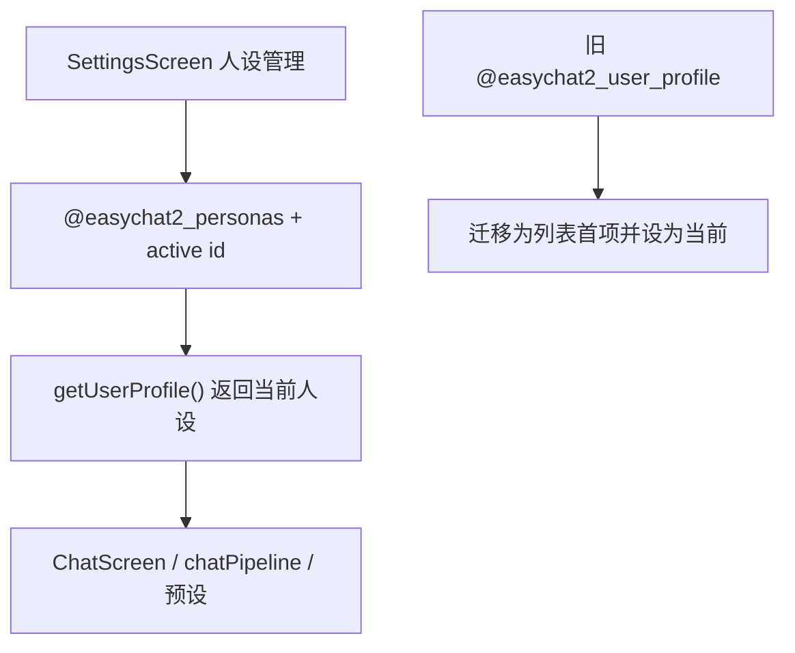

# 多用户人设 技术设计

Feature Name: user-personas-multi
Updated: 2026-09-18

## 描述

新增 `@easychat2_personas`（列表）与 `@easychat2_active_persona`（当前 id），并把既有 `@easychat2_user_profile` 作为迁移来源。`getUserProfile()` 保持返回当前人设的 `{ userName, persona, avatarUri }`，使既有调用方（ChatScreen、chatPipeline、全局预设）无需改动。

## 架构



## 组件与接口

### `src/storage.js`

```text
@easychat2_personas -> [
  { id, userName, persona, createdAt, updatedAt }
]
// 头像全局共用一个，继续存于 @easychat2_user_profile.avatarUri（迁移保留）
@easychat2_active_persona -> string
```

- `getPersonas()`：读取列表；当列表为空且存在旧 `@easychat2_user_profile` 时，迁移为一项（id 固定 `'default'`）并写入。
- `savePersonas(list)`：规范化并写入。
- `getActivePersonaId()` / `setActivePersonaId(id)`：
  - 读取时校验 id 存在，否则回退列表首项。
- `getActivePersona()`：返回当前人设。
- `getUserProfile()`：改为返回 `{ userName, persona, avatarUri }`，其中前两项来自当前人设，`avatarUri` 来自全局头像设置（`@easychat2_user_profile.avatarUri`），保持既有签名。
- `saveUserProfile(profile)`：更新当前人设（兼容既有调用）。

### `src/SettingsScreen.js`

- 人设区改为列表：每项展示名称，点击设为当前，提供编辑与删除；头像编辑仍为全局单个。
- 「新增人设」按钮创建空人设并设为当前。
- 至少保留一个人设；删除当前时切换到剩余首项。
- 迁移：首次进入时若只有旧结构，自动完成迁移。

### 全局预设

- `getEnabledGlobalPresetPrompts` 的 `{{user}}` 替换来源改为当前人设 `userName`（经 `getActivePersona`）。

## 数据模型

见上节两个键；旧键保留为迁移来源，不删除。

## 正确性属性

1. 旧数据迁移后 `getUserProfile()` 内容不变。
2. 当前人设 id 非法时回退列表首项。
3. 删除当前人设后仍有当前人设。
4. 至少保留一个人设。
5. 切换当前人设后，后续请求使用新人设。

## 错误处理

- 存储失败：提示并回滚内存状态。
- 列表为空且无旧数据：创建默认空人设。

## 测试策略

- 脚本：旧结构迁移、当前 id 非法回退、删除当前后的切换、至少保留一个。
- 脚本：`getUserProfile` 与 `getActivePersona` 一致性。
- 打包验证与手动验证。

## 参考

[^1]: (src/storage.js#L681) - 现有人设存储
[^2]: (src/ChatScreen.js) - 人设使用点
[^3]: (.monkeycode/specs/2026-09-18-user-personas-multi/requirements.md) - 需求来源
