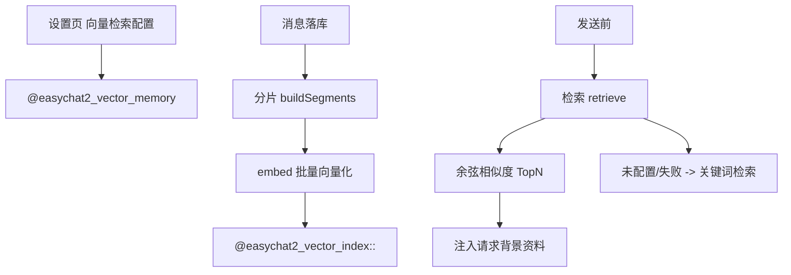

# 向量记忆检索 技术设计

Feature Name: vector-memory
Updated: 2026-09-18

## 描述

新增声明式 embedding 配置（OpenAI 兼容 `/embeddings`），本地保存片段与其向量，发送前做余弦相似度召回；未配置或失败时回退关键词检索。向量与片段存在本机，不进入仓库。

## 架构



## 组件与接口

### `src/vectorMemory/providers.js`（新增）

- OpenAI 兼容声明：`{ baseUrl, apiKey, model, dimensions?, batchSize, timeoutMs }`，默认 `baseUrl: 'https://api.openai.com/v1'`、`model: 'text-embedding-3-small'`。

### `src/vectorMemory/index.js`（新增）

| 函数 | 说明 |
|------|------|
| `chunkMessages(messages, { maxChars })` | 按消息边界与长度切分片段，附 `messageId` 与时间戳 |
| `embedTexts({ config, texts })` | 调用 `/embeddings`，批量请求，返回向量数组 |
| `cosineSimilarity(a, b)` | 余弦相似度 |
| `retrieve({ config, index, query, topK })` | 查询向量化后按相似度取 TopN |
| `keywordRetrieve({ index, query, topK })` | 本地关键词回退（按词命中计分） |
| `indexMessages({ characterId, messages, config })` | 增量分片并向量化，已存在片段跳过 |

- 全部为纯逻辑 + XHR，超时与错误映射沿用既有风格（401/403、429、其他）。

### `src/storage.js`

```text
@easychat2_vector_memory -> { enabled, baseUrl, apiKey, model, topK, maxChars }
@easychat2_vector_index::<characterId> -> [ { id, messageId, text, at, vector: number[] } ]
```

- 读取时规范化；索引按角色隔离；提供 `getVectorIndex` / `saveVectorIndex`。

### `src/ChatScreen.js`

- 消息落库后（幂等触发）异步执行 `indexMessages`，失败静默。
- 发送前调用 `retrieve`（或 `keywordRetrieve`），把结果作为 `pluginContext` 之外的新段落 `[相关记忆]` 传入 `buildRequestMessages`。

### `src/chatPipeline.js`

- `buildRequestMessages` 新增可选 `memorySnippets`（字符串数组），在 `[记忆摘要]` 之前追加：

```text
[相关记忆]
- <片段 1>
- <片段 2>
```

### `src/SettingsScreen.js`

- 新增「向量记忆」卡片：开关、地址、密钥（密文）、模型、召回条数、分片长度、测试连接。

## 数据模型

见上节。索引键按角色分片，避免超大单键。

## 正确性属性

1. 未配置或调用失败时使用关键词检索，不中断对话。
2. 已索引片段不重复向量化。
3. 召回条数与总长度受限。
4. 向量与片段仅存本机，不写入文档。
5. 密钥不进入请求提示词。

## 错误处理

- 向量接口 401/429/超时：回退关键词检索并静默。
- 索引读写失败：跳过本次注入。
- 测试连接失败：提示可读原因。

## 测试策略

- 脚本：`chunkMessages` 边界（空、超长、多消息）；`cosineSimilarity` 已知向量；`retrieve` 排序与 TopN；`keywordRetrieve` 命中计分；`indexMessages` 增量去重。
- 打包验证与手动验证（配置测试连接、无配置降级）。

## 参考

[^1]: (src/plugins/providers.js) - 声明式先例
[^2]: (src/chatPipeline.js) - 提示词注入点
[^3]: (.monkeycode/specs/2026-09-18-vector-memory/requirements.md) - 需求来源
