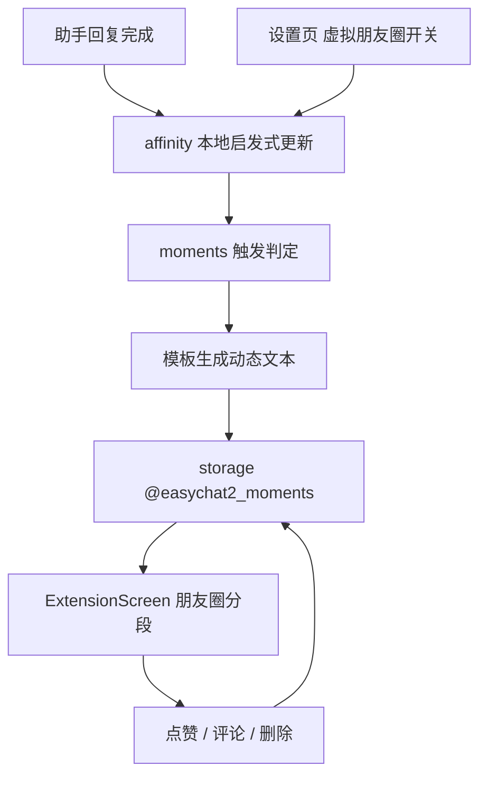

# 虚拟朋友圈 技术设计

Feature Name: virtual-moments
Updated: 2026-09-18

## 描述

新增本地启发式好感评估与阈值触发，产生角色朋友圈动态。动态存于本机，扩展页新增「朋友圈」分段展示全局时间线，支持点赞、取消点赞、评论与删除；用户首次评论后追加角色点赞。

## 架构



## 组件与接口

### `src/moments/affinity.js`（新增，纯函数）

- `evaluateTurn({ userText, assistantText })` → `{ delta, milestone }`
  - `delta`：基于关键词表的启发式增减（正向词、负向词、疑问、长回复等），单轮绝对值受限，如 `[-5, 5]`。
  - `milestone`：命中特殊大事关键词时返回事件标识，否则为 `null`。
- 关键词表为模块常量，便于调整；不做情感模型调用。

### `src/moments/moments.js`（新增，纯函数）

- `shouldTrigger({ affinity, turnCount, milestone, lastTriggers })` → `Trigger | null`
  - `affinity >= 100 && !lastTriggers.includes('affinity-best')` → `affinity-best`
  - `affinity <= -100 && !lastTriggers.includes('affinity-worst')` → `affinity-worst`
  - `turnCount === 50 && !lastTriggers.includes('turns-50')` → `turns-50`
  - `turnCount === 100 && !lastTriggers.includes('turns-100')` → `turns-100`
  - `milestone && !lastTriggers.includes('milestone-<id>')` → `milestone-<id>`
- `buildMomentText({ trigger, character })` → `string`：按触发类型选择模板并填入角色名；固定模板库，无模型调用。
- `MAX_MOMENTS` 上限（建议 200），超出时按时间淘汰最旧动态。

### `src/storage.js`

- 新增键：

```text
@easychat2_moments_settings -> { enabled: boolean }
@easychat2_moments -> [
  {
    id, characterId, characterName, avatarUri,
    trigger, text, createdAt,
    likedByUser: boolean,
    likes: [{ id, by: 'user' | 'character', name, createdAt }],
    comments: [{ id, name, text, createdAt, likedByCharacter: boolean }],
  }
]
@easychat2_affinity -> { [characterId]: { score, turnCount, triggers: string[] } }
```

- 新增函数：`getMomentsSettings` / `saveMomentsSettings`、`getMoments` / `saveMoments`、`getAffinity` / `saveAffinity`。
- 读取时校验结构并对非法项回退。

### `src/ExtensionScreen.js`

- 分段控件新增「朋友圈」（当设置开启时展示该分段）。
- 时间线列表：动态度、空状态、下拉无需网络。
- 动态操作：点赞/取消、评论输入、删除（长按或按钮）。

### `src/ChatScreen.js`

- 助手回复完成后，若朋友圈开启，调用 `evaluateTurn` 更新好感与轮次，再调用 `shouldTrigger` 判定并落库动态。
- 该流程与配图、播报触发的顺序：先消息落库，再执行好感与动态判定，互不阻塞。

### `src/SettingsScreen.js`

- 新增「虚拟朋友圈」开关横档；关闭时隐藏扩展页分段入口。

## 数据模型

见上节三个键。动态与好感按角色维度关联，时间线全局汇总。

## 正确性属性

1. 关闭开关时不生成新动态，既有动态保留。
2. 同一角色同一触发条件只产生一次动态。
3. 点赞与取消点赞幂等，不产生重复点赞者。
4. 删除动态只影响该条。
5. 好感评估与动态生成不产生网络请求。
6. 轮次统计只统计用户与助手的完整往返，不计入错误消息与占位。

## 错误处理

- 存储失败：`Alert` 提示保存失败，内存状态回滚。
- 动态文本模板缺失：回退通用模板。

## 测试策略

- 脚本：`evaluateTurn` 对正向、负向、中性文本的 `delta` 与 `milestone`。
- 脚本：`shouldTrigger` 的阈值边界（99/100、-99/-100、49/50、99/100）与去重。
- 脚本：点赞幂等、取消点赞、删除、首次评论追加角色点赞。
- 脚本：`MAX_MOMENTS` 淘汰策略。
- 打包验证与手动验证（开关、时间线、互动）。

## 参考

[^1]: (src/storage.js) - 持久化与默认值先例
[^2]: (src/ExtensionScreen.js) - 分段控件先例
[^3]: (src/ChatScreen.js) - 助手回复完成回调点
