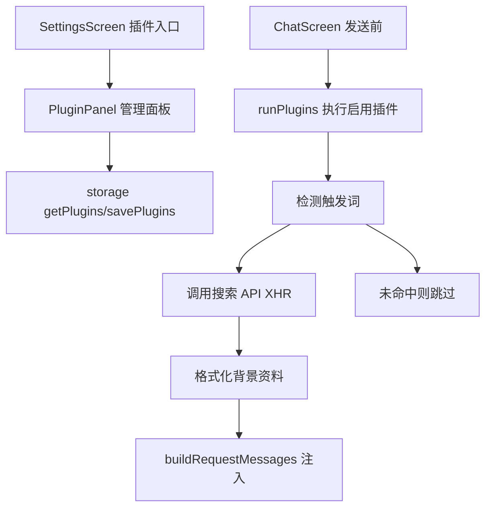

# 插件系统与联网搜索插件 技术设计

Feature Name: web-search-plugin
Updated: 2026-09-18

## 描述

引入插件注册表与插件运行时。首期实现「联网搜索」插件：开启后在发送请求前检测用户消息，命中触发词则调用搜索 API，把结果摘要注入系统提示词作为背景资料，再进入 `buildRequestMessages` 组装。沿用全局预设的启用开关形态，插件配置独立存储。

## 架构



## 组件与接口

### `src/storage.js`

- `getPlugins()` / `savePlugins(plugins)`：读写 `@easychat2_plugins`，内置插件缺失时补入默认项。
- `getEnabledPlugins()`：返回已开启插件列表。

### `src/plugins/webSearch.js`（新增）

`runWebSearch({ query, config })`：拼接 Provider 请求、用 `XMLHttpRequest` 调用（沿用 `api.js` 的超时与累积响应方式），解析标题/链接/摘要，超时 10 秒。

### `src/plugins/registry.js`（新增）

- 插件声明表：`{ id, name, description, type, config }`。
- `runPlugins({ userText, configs })`：遍历启用插件，命中触发词则执行并返回注入文本。

### `src/ChatScreen.js`

发送流程（`src/ChatScreen.js:694`）在 `buildRequestMessages` 前先取 `getEnabledPlugins()`，执行 `runPlugins`，把结果传给 `buildRequestMessages`。

### `src/chatPipeline.js`

`buildRequestMessages` 增加可选 `pluginContext` 参数，追加为 `[背景资料]` 段。

### `src/SettingsScreen.js` 与 `src/PluginPanel.js`（新增）

设置页「插件」入口打开面板：开关、Provider 选择、密钥（密文）、结果条数。

## 数据模型

```text
@easychat2_plugins -> [{
  id: 'web-search',
  name: '联网搜索',
  type: 'web-search',
  enabled: true,
  config: {
    provider: 'serpapi' | 'google-cse' | 'bing' | 'custom',
    apiKey: '<masked-in-ui>',
    customBaseUrl: '',
    maxResults: 5
  }
}]
```

## 正确性属性

1. 只有插件开启且消息命中触发词才发起搜索。
2. 密钥不进入提示词、消息文本与错误日志（沿用 `SECRET_PATTERN` 掩码）。
3. 搜索失败/超时静默降级，不影响回复。
4. 触发词列表内置「最新|今天|现在|新闻|时事|股价|天气|汇率」等，可后续扩展。
5. 搜索频率限制：同一会话内两次搜索间隔不小于 30 秒。

## 错误处理

- 未填密钥：开启时提示，发送时跳过搜索不注入。
- 搜索失败/超时：跳过注入，继续原流程。
- Provider 未配置：视为未启用。

## 测试策略

- 触发词命中与降级脚本：命中/未命中/失败超时。
- Provider 请求解析脚本：不同 Provider 响应格式。
- 注入格式脚本：`buildRequestMessages` 含插件上下文。
- 打包验证：`npx expo export --platform android`。

## 分期

1. storage 插件模型与默认项。
2. 注册表与 webSearch Provider 适配。
3. ChatScreen 接线与降级。
4. 设置页插件面板与密钥密文。

## 参考

[^1]: (src/storage.js#L380) - 现有预设 normalize 与存储
[^2]: (src/chatPipeline.js#L50) - 请求组装入口
[^3]: (src/ChatScreen.js#L694) - 发送前取全局预设
[^4]: (src/api.js#L58) - 现有 XHR 超时模式
[^5]: (src/secrets.js#L1) - 密钥掩码