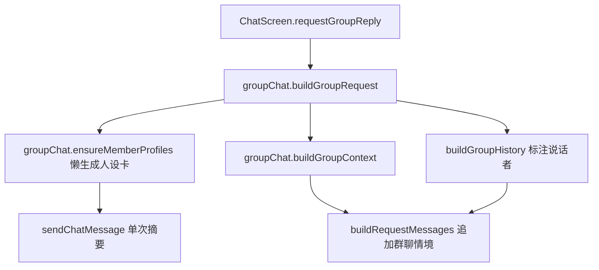

# 群聊情境感知 技术设计

Feature Name: group-chat-context
Updated: 2026-09-19

## 描述

在现有群聊回复链路上，为每个发言角色的请求追加一段 `[群聊情境]` system 内容。情境内容包含在场成员名单（名称 + 简介/人设卡 + 最近发言）与最近群聊对话（标注说话者），让角色具备群聊在场感。所有角色共享同一份群聊历史，各角色的差异仅体现在自身角色卡与自我认知上。

为处理角色卡简介缺失或随意的情况，系统对「简介不足」的成员懒生成一次人设卡并缓存在会话中。

## 架构



## 组件与接口

- `src/groupChat.js`：
  - 常量 `PROFILE_MIN_CHARS = 30`、`MEMBER_RECENT_LINES = 3`、`GROUP_RECENT_LINES = 8`。
  - `needsProfile(character)`：`description` + `personality` 拼接去空白后字符数 `< 30` 返回 true。
  - `buildProfilePrompt(character)`：基于完整角色卡构造生成人设卡的提示词。
  - `generateMemberProfile(character)`：调用 `sendChatMessage` 生成 1-2 行第三人称简介；失败返回 `null`。
  - `ensureMemberProfiles({ characters, profiles })`：对简介不足且无缓存的成员逐个生成，返回新的 `profiles`（`{ [characterId]: text }`）。调用方负责持久化。
  - `buildGroupContext({ speaker, characters, historyMessages, profiles })`：返回 `[群聊情境]` 文本。成员行 = 名称 + 简介（缓存优先，其次卡内 description/personality，最后占位）；若有该成员最近发言则附上摘录。附最近群聊对话，历史为空时省略对话区块。
  - 修改 `buildGroupRequest({ speaker, characters, historyMessages, userText, userProfile, globalPresets, quote, summaryText, pluginContext, profiles })`：计算情境文本并作为 `groupContext` 传入 `buildRequestMessages`。
  - `buildGroupHistory` 保持不变（已为 assistant 消息加「角色名：」前缀）。
- `src/chatPipeline.js`：
  - `buildRequestMessages` 增加可选参数 `groupContext`；在其为非空字符串时追加到 system 内容。单聊传空即行为不变。
- `src/ChatScreen.js`：
  - `requestGroupReply` 在构造请求前调用 `ensureMemberProfiles`，将结果写回会话并持久化，再传入 `buildGroupRequest`。
- `src/storage.js`：
  - 群聊会话新增可选字段 `memberProfiles`（`{ [characterId]: text }`），随会话持久化。

## 数据模型

```text
session(群聊): { ..., members, memberProfiles: { [characterId]: profileText } }
buildGroupContext 返回（字符串）：
[群聊情境]
这是一个多人群聊，你正在与其他角色一起与用户对话。
在场成员：
- A：简介（卡内或生成的人设卡）
- B：简介
  最近发言：...
- C：简介
除你以外的其他角色也会发言，你只代表你自己。

最近对话：
用户：...
B：...
```

## 正确性属性

1. 单聊请求不包含 `[群聊情境]`，行为与改造前一致。
2. 群聊请求中，每个发言角色的 system 段都包含完整在场成员名单。
3. 情境中的「你」始终指向当前发言角色，成员列表含全部成员并区分自身与他人。
4. 简介不足判定基于 `description` + `personality` 去空白后 `< 30` 字符。
5. 同一成员的人设卡只生成一次，后续复用缓存。
6. 生成失败时回退占位简介，群聊请求不被阻塞。
7. 历史为空时不产生空的「最近对话」区块；成员无发言时不产生空的发言区块。
8. 同轮后发言角色能看到同轮前述角色发言（历史在同一轮内累积）。

## 错误处理

- 成员列表为空或角色名缺失：使用占位名（如「角色」），不抛错。
- 人设卡生成失败：回退为成员名称占位，不写入缓存（下次仍会尝试）。
- 历史条目文本为空或超长：按现有截断策略处理，不阻塞请求。

## 测试策略

- 脚本：`needsProfile` 在 29/30 字符边界、空简介、完整简介下的结果。
- 脚本：`buildGroupContext` 在 3 人、含历史 / 空历史、含缓存人设卡 / 无缓存三种情况下的输出。
- 脚本：`buildGroupRequest` 的 system 段包含 `[群聊情境]` 且自我认知为当前角色。
- 脚本：`buildRequestMessages` 在 `groupContext` 为空时与改造前逐字段一致。
- Android 导出验证。

## 分期

1. `buildGroupContext` 与 `buildRequestMessages` 参数扩展。
2. `needsProfile` / `generateMemberProfile` / `ensureMemberProfiles` 与 `memberProfiles` 持久化。
3. `buildGroupRequest` 接入与历史标注回归。
4. 手动验证三人群聊的角色在场感、简介缺失成员的兜底、单聊无回归。

## 参考

[^1]: (src/groupChat.js#L186) - 现有 buildGroupRequest
[^2]: (src/chatPipeline.js#L50) - 现有请求构造
[^3]: (src/ChatScreen.js#L1532) - 现有群聊回复流程
