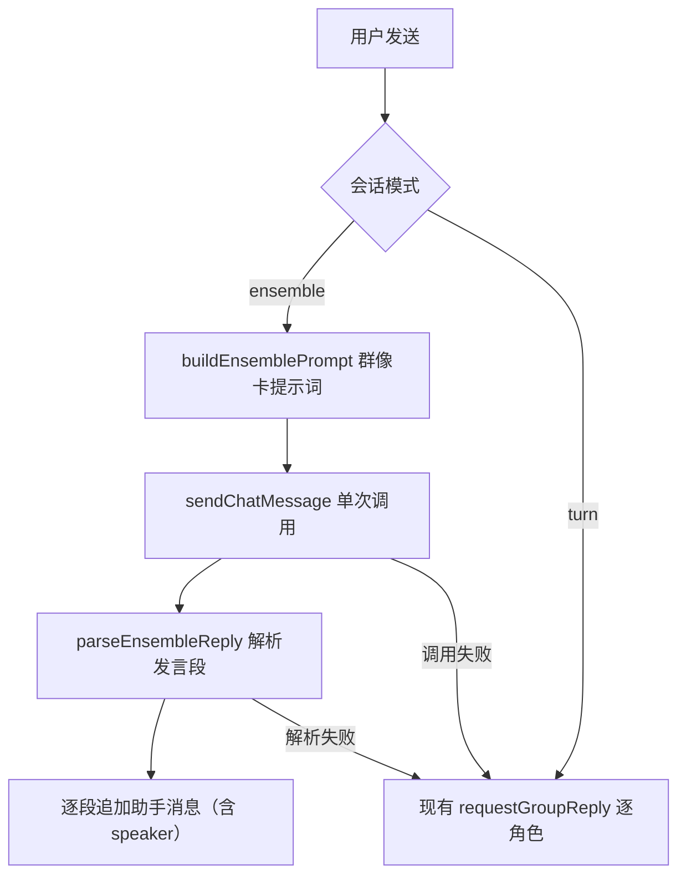

# 群像卡群聊 技术设计

Feature Name: group-ensemble-card
Updated: 2026-09-19

## 描述

在群聊中新增「群像卡」模式：把全部成员设定合并为一份系统提示词，每轮只调用一次 LLM，由模型自行编排多角色发言，输出按「角色名：」分段；前端解析为多条带发言者的助手消息。会话记录模式，缺省群像卡；生成或解析失败回退现有逐角色模式。

## 架构



## 组件与接口

### `src/groupChat.js`

- 新增 `buildEnsemblePrompt({ characters, historyMessages, userText, userProfile, globalPresets, profiles, mentions })`：
  - system 段：群像卡说明 + 全部成员设定（名称/简介/性格/语气）+ 输出格式要求（「角色名：内容」分段、段间空行、只写角色发言不写旁白）+ `@` 命中提示。
  - 复用 `buildGroupContext` 的在场成员简介与最近发言。
  - history 使用 `buildGroupHistory`（既有「角色名：」前缀）。
  - 追加用户新消息。
- 新增 `parseEnsembleReply(text, characters)`：按行扫描，遇「角色名：」开头的段起始新段；返回 `[{ speakerId, speakerName, text }]`。
  - 角色名匹配：先精确匹配成员 `name`，再前缀包含匹配。
  - 无法匹配的段保留文本，`speakerId` 为空、`speakerName` 取原文名称。
  - 无任何可识别段时返回 `[]`（触发回退）。
- 新增 `mergeAdjacentSegments`（可选）：合并同一角色的连续段，减少消息碎片。
- 常量 `ENSEMBLE_MODE = 'ensemble'`、`TURN_MODE = 'turn'`。

### `src/context/sessionLibrary.js`

- 群聊会话新增可选字段 `groupMode`（`'ensemble' | 'turn'`），规范化缺省 `'ensemble'`。
- `createGroupSession` 默认写入 `groupMode: 'ensemble'`。

### `src/ChatScreen.js`

- `requestGroupReply` 读取当前会话 `groupMode`：
  - `ensemble`：构造群像卡提示词 → 单次 `sendChatMessage`（含流式 `onChunk` 时把累计文本作为「临时段」渲染）→ `parseEnsembleReply` → 逐段写入助手消息。
  - 解析为空或调用抛错：回退调用现有逐角色逻辑（抽取为内部函数 `runTurnSpeakers`）。
  - `turn`：保持现状。
- 流式渲染：群像卡模式流式过程中，把累计文本放入单条 pending 消息；解析完成后替换为多条消息。非流式直接解析。

### `src/groupChat.js`（保留）

- 现有 `selectSpeakers`、`buildGroupRequest`、`generateOpening`、`buildGroupContext` 保留，供回退与开场使用。

## 数据模型

```text
session(群聊): { ..., groupMode: 'ensemble' | 'turn' }
助手消息: { id, role, text, speakerId?, speakerName? }
```

## 正确性属性

1. 群像卡模式下每轮仅一次 LLM 调用（回退时除外）。
2. 解析出的每条消息带发言者信息；无法匹配的段不丢失文本。
3. 解析为空或调用失败时回退逐角色，不中断对话。
4. `@` 指定在被点名角色存在时生效。
5. 非群聊与 `turn` 模式行为不变。
6. 迟到回复仍受会话 `id`/版本守卫，不写入其他会话。

## 错误处理

- 生成失败：回退逐角色模式。
- 解析为空：回退逐角色模式。
- 无法匹配的角色名：保留文本，标记未知发言者。
- 成员不足或为空：不生成，提示。

## 测试策略

- 脚本：`parseEnsembleReply` 在各种输出（标准分段、无空行、含旁白、角色名含冒号、未知角色、空输入）下的解析。
- 脚本：`buildEnsemblePrompt` 含全部成员与格式要求，注入 `@`。
- 脚本：会话 `groupMode` 规范化与默认值。
- 静态检查：`requestGroupReply` 在 ensemble 下单次调用且解析失败回退。
- Android 导出验证。

## 分期

1. 会话 `groupMode` 字段与规范化。
2. `buildEnsemblePrompt` 与 `parseEnsembleReply` 纯逻辑 + 脚本测试。
3. `ChatScreen` 接线（含流式与回退）。
4. 手动验证与文档同步。

## 参考

[^1]: (src/groupChat.js) - 现有逐角色请求与群聊情境
[^2]: (src/ChatScreen.js#L1609) - 现有 requestGroupReply
[^3]: (src/context/sessionLibrary.js#L104) - createGroupSession
