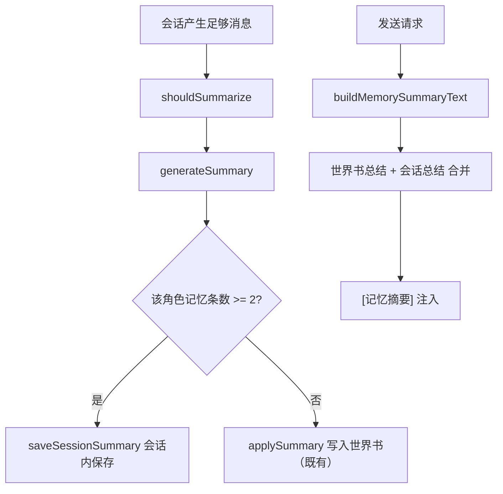

# 记忆总结按会话作用域 技术设计

Feature Name: memory-summary-scope
Updated: 2026-09-19

## 描述

当某角色的记忆条数 ≥ 2 时，把记忆总结从「角色世界书」改为「会话内存储 + 请求上下文压缩」。判定基于记忆页可见的会话（`characterId` 相同且 `preview` 非空）。既有世界书条目保留；摘要读取同时兼容旧的世界书来源与会话来源。

## 架构



## 组件与接口

### `src/memorySummary.js`

- 新增 `countCharacterMemories(sessions, characterId)`：返回 `characterId` 相同且 `preview` 非空的会话数量。
- 新增 `buildMemorySummaryText(character, session)`：改为同时读取世界书「记忆总结」条目与当前会话内总结，按顺序合并。为兼容既有调用方，`session` 为可选参数，缺省时仅返回世界书部分。
- 修改 `applySummary({ session, character, messages, updateCharacter, userName, memoryCount })`：
  - 当 `memoryCount >= 2`：把 `{ summary, keywords }` 追加到会话累计总结（经新存储函数），更新 `summarizedUpTo`，不调用 `updateCharacter`。
  - 否则：保持既有写入世界书逻辑。
- 新增 `selectSummaryContext({ character, session, scoped })`：当 `scoped`（记忆条数 ≥ 2）时只用会话总结；否则沿用世界书。实际合并策略由 `buildMemorySummaryText` 实现。

### `src/storage.js`

- 新增会话级总结存储：
  - `@easychat2_session_summaries::<sessionId>` -> `[{ summary, keywords, boundary, createdAt }]`
  - `getSessionSummaries(sessionId)` / `appendSessionSummary(sessionId, entry)` / `saveSessionSummaries(sessionId, list)`
- 会话删除时应一并清理该键（在 `deleteSession` / `deleteSessions` 内 `removeItem`）。

### `src/ChatScreen.js`

- `runSummarize` 计算 `memoryCount = countCharacterMemories(sessionsRef.current, character.id)`，传入 `applySummary`。
- `requestReply` 调用 `buildMemorySummaryText(character, currentSession)`，其中 `currentSession` 为发送会话。
- 手动总结提示文案按落点区分：「已写入角色世界书」或「已压缩为本会话上下文」。

## 数据模型

```text
SessionSummary: { summary: string, keywords: string[], boundary: string, createdAt: number }
@easychat2_session_summaries::<sessionId> -> SessionSummary[]
```

## 正确性属性

1. 记忆条数 ≥ 2 时不再新增世界书条目。
2. 记忆条数 < 2 时行为与改造前一致。
3. 既有世界书「记忆总结」条目保留，且仍可被读取。
4. 会话总结按会话隔离，切换会话不串味。
5. 删除会话时清理其会话总结键。
6. 摘要上下文仅来自当前会话（scoped）或世界书（非 scoped），不混入其他会话。
7. 会话无总结时不注入摘要。

## 错误处理

- 会话总结读写失败：不阻塞发送，摘要为空。
- 记忆条数读取失败：回退为既有世界书行为。

## 测试策略

- 脚本：`countCharacterMemories` 计数（同角色多会话、空摘要、群聊排除）。
- 脚本：`applySummary` 在 `memoryCount >= 2` 时不调用 `updateCharacter`，写会话存储并更新边界。
- 脚本：`buildMemorySummaryText` 合并世界书与会话总结、空输入、按会话隔离。
- 脚本：删除会话清理总结键。
- Android 导出验证。

## 分期

1. 存储层会话总结读写与删除清理。
2. `memorySummary` 计数、作用域判定与上下文合并。
3. `ChatScreen` 接线与提示文案。
4. 回归与文档同步。

## 参考

[^1]: (src/memorySummary.js#L102) - 现有摘要读取
[^2]: (src/memorySummary.js#L112) - 现有总结写入世界书
[^3]: (src/MemoryScreen.js#L74) - 记忆页会话过滤
