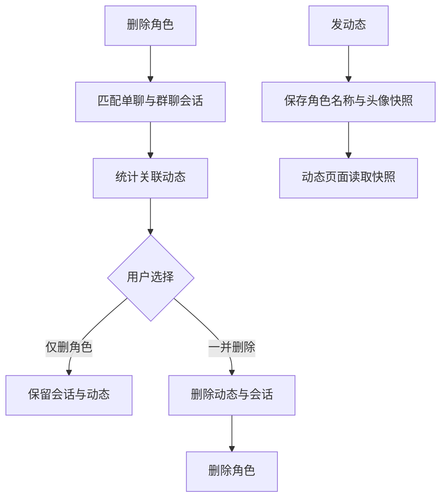

# 角色删除关联数据与动态身份技术设计

Feature Name: character-deletion-data
Updated: 2026-09-24

## 描述

角色删除入口统一先计算关联会话与动态，再展示“仅删角色”和“角色、记忆和动态都删”选项。关联会话通过 `characterId` 与群聊 `members` 双重匹配；动态通过角色 id 或会话 id 匹配。动态创建时捕获发送者快照，动态页面只读取快照展示名称与头像。

## 架构

## 组件与接口

### `src/context/sessionLibrary.js`

- `selectSessionsForCharacters(sessions, characterIds)`：匹配单聊归属和群聊成员，返回关联会话。

### `src/moments/moments.js`

- `countMomentsForCharacterDeletion(list, characterIds, sessionIds)`：统计角色或会话关联动态。
- `removeMomentsForCharacterDeletion(list, characterIds, sessionIds)`：过滤关联动态并保持其余顺序。

### `src/storage.js`

- `deleteMomentsForCharacterDeletion(characterIds, sessionIds)`：读取动态状态，损坏时中止，正常时保存过滤结果。

### `src/CharacterScreen.js`

- 删除前统计关联会话和动态数量。
- 根据选择执行仅删角色或完整清理。
- 删除当前群聊时向 `AppContext.deleteSessions` 传入待删角色 id，确保新会话回退到有效角色。

### `src/ChatScreen.js` 与 `src/MomentsView.js`

- 发送请求开始时捕获角色 id、会话 id、名称和头像。
- 生成动态时写入快照，不依赖响应结束时的当前角色列表。
- 动态卡片与评论回复优先使用 `characterName` 快照，删除角色后仍显示原名称。

## 数据模型

无新增 AsyncStorage 键。会话使用现有 `characterId`、`type` 和 `members` 字段；动态继续使用现有 `characterId`、`sessionId`、`characterName` 和 `avatarUri` 字段。

## 正确性属性

1. 角色关联会话集合包含所有单聊归属和群聊成员匹配项，且每个会话只出现一次。
2. “仅删角色”路径不删除关联动态和会话。
3. “一并删除”路径先清理动态，再删除会话，最后删除角色。
4. 动态创建后，角色改名或删除不会改变已保存的名称与头像。
5. 群聊当前会话被删除后，活动会话归属仍然有效。

## 错误处理

- 动态状态为 `corrupt` 时停止删除并提示用户。
- 动态清理、会话删除或角色删除失败时显示错误提示。
- 活动群聊删除时使用未被排除的角色创建替代会话。

## 测试策略

- `tests/sessionLibrary.test.mjs`：单聊、群聊成员匹配。
- `tests/moments.test.mjs`：按角色 id 与会话 id统计、过滤动态。
- 执行全量 `npm test`、ESLint 和 Android Expo Export。
