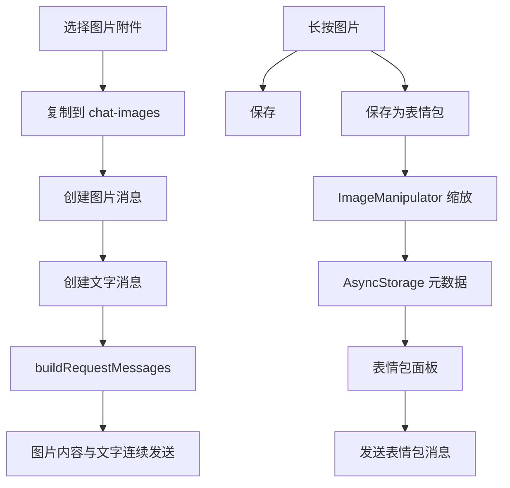

# 聊天图片消息与表情包技术设计

Feature Name: chat-stickers
Updated: 2026-09-24

## 描述

将图片附件转换为独立的媒体消息，并通过 `chatMedia` 统一生成媒体提示文本。表情包元数据使用 `@easychat2_sticker_index` + `@easychat2_sticker_item::<id>` 分片保存，旧版 `@easychat2_stickers` 仅迁移读取；图片文件保存到 `documentDirectory/stickers`，创建时使用 Expo Image Manipulator 按宽高各缩小一半。

## 架构



## 组件与接口

### `src/chatMedia.js`

- `createMediaMessage`：创建图片或表情包用户消息。
- `getMessagePromptText`：为历史记录和模型上下文生成媒体名称提示。
- `IMAGE_MESSAGE_KIND` / `STICKER_MESSAGE_KIND`：区分普通图片与表情包。

### `src/attachments.js`

- `pickStickerImage`：调用 `expo-image-picker` 打开相册。
- `persistImageAttachment`：将普通聊天图片复制到文档目录。
- `getImageDimensions`：读取图片尺寸。

### `src/stickerImages.js`

- `createStickerImage`：按宽高 0.5 倍缩放并压缩为 JPEG，再复制到表情包目录。

### `src/storage.js`

- `getStickers`：从索引与分片键读取并规范化表情包元数据，兼容迁移旧数组键。
- `saveSticker`：串行新增或更新表情包分片元数据，索引最后提交。

### `src/ChatScreen.js` 与 `src/chatPipeline.js`

- `sendMessage` 先追加媒体消息，再追加文字消息。
- 当前媒体消息作为独立 user content 传入模型；历史媒体消息使用名称提示。
- 表情包面板包含首项添加入口、表情包缩略图和名称输入弹窗。
- 长按图片提供保存与保存为表情包操作。
- 文字用户消息的「修改重发」先弹确认；确认后通过 `getEditResendPlan` 截断目标消息及后续回复并回填输入框。

### `src/messageSelection.js`

- `getEditResendPlan(messages, targetId)` 生成撤回后的消息前缀与原文字，供界面确认流程使用。

## 数据模型

媒体消息：

```javascript
{
  id: 'image-id',
  role: 'user',
  kind: 'image' | 'sticker',
  text: '',
  image: {
    uri: 'file:///...',
    mime: 'image/jpeg',
    name: '照片.jpg',
    width: 800,
    height: 600,
    stickerId: 'sticker-id',
    stickerName: '开心'
  },
  timestamp: 0
}
```

表情包元数据：

```javascript
{
  id: 'sticker-id',
  name: '开心',
  uri: 'file:///.../stickers/sticker.jpg',
  mime: 'image/jpeg',
  width: 200,
  height: 200,
  createdAt: 0
}
```

## 正确性属性

1. 图片与文字发送时，媒体消息始终位于文字消息之前。
2. 持久化消息只保存文档目录 URI，不依赖临时缓存 URI。
3. 表情包宽高约为源图的一半，并以 JPEG 压缩保存。
4. 不支持识图的模型仍能收到 `【表情包：名称】` 提示。
5. 表情包面板添加入口始终位于第一项。
6. 修改重发确认后，目标用户消息及后续回复被撤回，原文字回填输入框。
7. 图片文件回收只删除未被会话消息或待发送附件引用的文件。

## 错误处理

- 图片复制、读取或缩放失败时提示用户并保留当前输入。
- 表情包名称为空时阻止保存。
- 表情包元数据损坏时备份原始值并停止新增写入。
- 相册取消选择时不改变当前表情包列表。
- 图片选择先检查文件大小，再检查尺寸；单文件 12 MiB、1600 万像素、单次 3 张、总文件 20 MiB、Base64 28 MiB。
- ImagePicker pending 结果在界面恢复时自动消费，表情包元数据写入串行化。

## 测试策略

- `tests/chatMedia.test.mjs`：媒体消息结构与名称提示。
- `tests/chatPipeline.test.mjs`：图片/文字连续消息与无识图表情包提示。
- `tests/messageSelection.test.mjs`：修改重发撤回与文字回填计划。
- `tests/attachments.test.mjs`：图片大小、像素、总量、MIME 与 pending 结果。
- `tests/characterStorage.test.mjs`：聊天图片回收、跨会话引用保护、会话队列与表情包分片迁移。
- 执行全量 `npm test`、ESLint 和 Android Expo Export。
