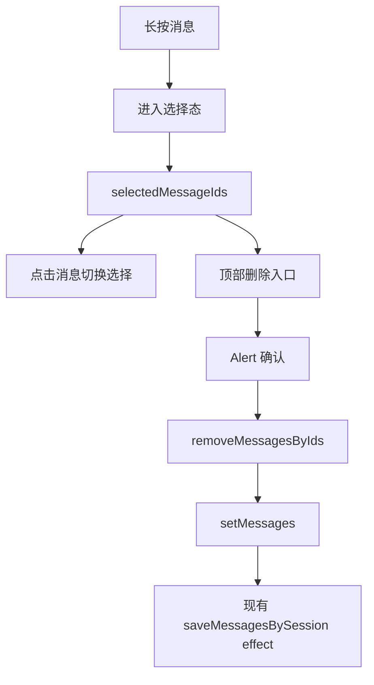

# 聊天消息长按多选删除技术设计

Feature Name: message-multi-delete
Updated: 2026-09-24

## 描述

在聊天消息列表中增加选择态。消息容器使用 `Pressable` 处理长按，选择态使用顶部操作栏展示数量、取消和删除入口。删除通过 `Alert` 二次确认，状态更新后复用现有消息持久化 effect 写回当前会话。

## 架构

## 组件与接口

### `src/messageSelection.js`

- `toggleMessageSelection(selectedIds, messageId)`：添加或移除消息 id。
- `removeMessagesByIds(messages, messageIds)`：按 id 过滤消息并保持原顺序。

### `src/ChatScreen.js`

- `selectedMessageIds` 保存当前选择集合。
- 消息容器处理长按、选择态点击和无障碍选中状态。
- 顶部栏在选择态显示取消、已选数量和删除操作。
- `confirmDeleteSelectedMessages` 在 `Alert` 确认后更新消息、错误缓存、布局缓存和定位高亮。
- 选择态隐藏消息操作行并禁用输入发送入口。
- 会话切换和消息列表变化时清理失效选择。

## 数据模型

无新增 AsyncStorage 键。消息 id 继续使用现有会话消息模型；删除后的消息由 `saveMessagesBySession` 覆盖当前会话消息键，并更新会话预览。

## 正确性属性

1. 选择集合只包含当前会话中已完成的真实消息 id。
2. 确认删除后，选中消息从内存状态和持久化快照中同时消失。
3. 取消确认不会改变消息数组或选择集合。
4. 会话切换期间打开的确认操作不会写入新会话。
5. `pending` 消息不进入选择集合，也继续遵守现有不落盘规则。

## 错误处理

- 消息持久化沿用现有失败提示 `聊天记录保存失败`。
- 确认弹窗取消时保持当前选择状态。
- 确认时会话版本或会话 id 已变化时直接结束操作，避免跨会话删除。

## 测试策略

- `tests/messageSelection.test.mjs` 覆盖选择切换、批量过滤、顺序保持和输入边界。
- 执行全量 `npm test`、项目 ESLint 检查和 Android Expo Export 验证打包。

## 参考

- `.monkeycode/docs/INTERFACES.md`
- `.monkeycode/docs/模块/界面层.md`
- `src/ChatScreen.js`
- `src/messageSelection.js`
