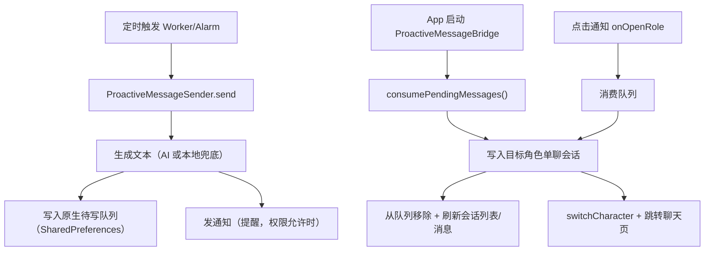

# 主动消息写入会话 技术设计

Feature Name: proactive-message-persistence
Updated: 2026-09-29

## 描述

原生调度到点生成主动消息文本后，**不再只发通知**，而是把消息写入原生侧待写队列（SharedPreferences，跨进程安全且 App 被杀也不丢）。JS 在应用启动与收到 `onOpenRole` 事件时消费队列，调用现有存储层把消息写进对应角色的单聊会话；随后发通知作为提醒。

选择「原生落队列 + JS 落会话」而非「原生直接写会话存储」，原因：
- 会话消息存储是 AsyncStorage/SQLite，由 RN 进程独占，原生跨进程直写有并发与格式风险；
- 现有 `consumeInitialRole` 已是「原生暂存 → JS 消费」的成熟模式，复用同一范式；
- App 未打开时消息也不会丢，下次打开即补写。

## 架构



## 组件与接口

### 原生（`plugins/proactiveMessage/android/`）

**`MessageStore`（`ProactiveCore.kt`，修改）** 新增待写队列的读写：

```text
data class PendingMessage(slotId, roleId, roleName, text, createdAt)
fun appendPendingMessage(message: PendingMessage)         // 追加，带上限与超期淘汰
fun loadPendingMessages(): List<PendingMessage>
fun removePendingMessages(ids: List<String>)              // 按 slotId+createdAt 定位
```

- 存储键：`proactive_message_prefs` 下的 `pending_messages`（JSON 数组）。
- 上限：最多保留 `MAX_PENDING`（如 100）条，超出按 `createdAt` 淘汰最旧。
- 超期：`createdAt` 超过 `MAX_PENDING_AGE_MS`（7 天）的读取时丢弃。
- 生成消息 id：`"${slotId}-${yyyy-MM-dd}"`，与「每槽每日一条」对齐，写入端据此幂等。

**`ProactiveMessageSender.send`（修改）**：生成文本后先 `appendPendingMessage`，再发通知。通知权限被拒**不再影响**落库；`markSlotSentToday` 语义收敛为「本槽今日已生成过消息」，不再代表「已成功提醒」。

**`ProactiveMessageModule`（修改）** 新增 `@ReactMethod`：

```text
fun consumePendingMessages(promise: Promise)   // 返回 List<Map>，并清空已返回项
```

- 返回结构：`[{ id, roleId, roleName, text, createdAt }]`。
- 与 `consumeInitialRole` 同样「读取即清空」，避免重复消费。
- 保留 `onOpenRole` 事件（只带 roleId，用于跳转）；消息内容通过 `consumePendingMessages` 取。

### JS（`src/proactiveMessage.js`，修改）

```text
export async function consumePendingMessages()   // 调原生，返回消息数组
```

### JS（`src/App.js` 的 `ProactiveMessageBridge`，修改）

- 启动 effect 与 `onOpenRole` 回调中：先 `consumePendingMessages()`，逐条写入会话，再处理跳转。
- 写入逻辑调用新增的存储/上下文能力（见下），成功后原生侧已随 consume 清空。
- 幂等：写入前按消息 id 去重（同一会话已有同 id 则跳过）。

### 存储与上下文（新增最小接口）

主动消息是「以角色身份、追加一条 assistant 消息到其单聊会话」。复用现有能力而非新造：

```text
// 新增：把一个角色的一条主动消息落到其单聊会话
src/context/AppContext.js 或 src/storage 层
ensureCharacterSession(characterId)  // 已有，返回/建立该角色主会话
appendProactiveMessage(sessionId, { id, text, createdAt })
```

- `appendProactiveMessage` 读会话消息（`getMessagesBySession`）→ 追加 `{ id, role:'assistant', text, timestamp: createdAt, proactive:true }` → `saveMessagesBySession`。
- 若消息 id 已存在则跳过（幂等）。
- 通过 `AppContext` 暴露给 `App.js` 使用，写入后触发会话刷新（`refreshSessions`）。

## 数据模型

```text
原生 pending_messages（SharedPreferences）:
  [{ id, slotId, roleId, roleName, text, createdAt }]

会话消息（追加）:
  { id: "<slotId>-<yyyy-MM-dd>", role: 'assistant', text, timestamp, proactive: true }
```

## 正确性属性

1. 主动消息落库不依赖通知权限。
2. 消费幂等：同一 `slotId` 同一天不产生重复消息。
3. 原生队列有界且有超期淘汰。
4. 消费「读取即清空」，不重复返回。
5. App 未打开时消息不丢，下次打开补写。
6. 不新增额外会话；复用 `ensureCharacterSession` 的目标会话。

## 错误处理

- 原生队列读取失败：返回空列表并记录日志，不崩溃。
- JS 写入失败：保留原生队列（消费失败不回滚清空）——需原生提供「只在 JS 确认后清空」或 JS 侧重试；实现上采用「consume 返回后 JS 逐条写，写失败的 id 记录并在下次启动重试」。
- 角色已删除：跳过该条并移除，避免队列卡死。

## 测试策略

- Kotlin 侧：`PendingMessage` 队列的追加/上限淘汰/超期丢弃/幂等 id 生成（纯逻辑可测；若无法在纯 JVM 跑，则以源码断言覆盖关键约束）。
- JS 侧新增纯函数测试：`buildProactiveMessageId(slotId, date)`、`mergeProactiveMessage(messages, incoming)`（幂等去重、追加位置）。
- 源码断言：`ProactiveMessageSender` 在发通知前必须调用 `appendPendingMessage`；`Notifier` 权限被拒不阻断落库。
- 手动验证（`SMOKE_TEST.md`）：设一个 1 分钟后的槽 → 后台到点 → 打开 App → 会话里出现该消息；点通知进入能看到该消息；通知权限关闭时消息仍落库。

## 阶段归属

属「阶段 1 之前的必修缺陷」——它不依赖 SDK 升级，是现有功能的正确性问题。

## 参考

[^1]: (`plugins/proactiveMessage/android/ProactiveCore.kt`) - 现有 `MessageStore`/`ProactiveMessageSender`/`Notifier`
[^2]: (`src/proactiveMessage.js`) - `consumeInitialRole` 的「原生暂存 → JS 消费」先例
[^3]: (`src/App.js` `ProactiveMessageBridge`) - 现有跳转桥接
