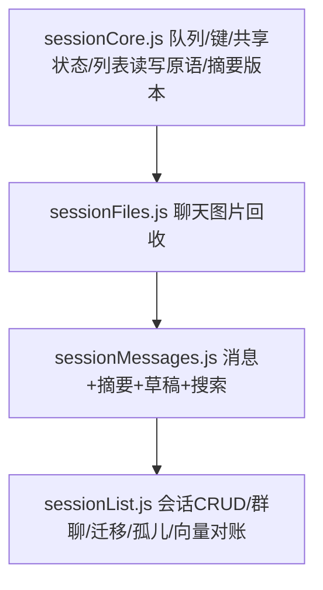

# 会话存储拆分 技术设计

Feature Name: session-storage-split
Updated: 2026-09-29

## 描述

`src/storage/sessions.js` 原为 1119 行的单文件，混合了会话列表、消息、记忆摘要、输入草稿、
全库搜索、聊天图片回收、会话 CRUD、群聊、迁移、孤儿恢复、向量对账等职责。本次按**分层**
拆分，保持 `src/storage.js` barrel 与 `sessions.js` barrel 的对外 API 完全不变（零行为变化）。

## 分层与依赖方向

`sessionCore` ← `sessionFiles` ← `sessionMessages` ← `sessionList`，严格单向，无循环。

- **为何消息与摘要合并**：写消息时要读摘要（补回会话行时读 boundary），推进摘要边界时要读消息，
  二者本就双向耦合，拆开必然形成 ESM 循环，故合并进 `sessionMessages.js`。
- **为何共享状态集中在 core**：`sessionMutationQueue`、`deletedSessionIds`、
  `sessionSummaryRevisions`、`protectedChatImageUris` 是跨模块共享的可变状态，必须单一实例。
  集中到 `sessionCore` 后其余模块 import 同一实例，语义与拆分前一致。

## 文件职责

| 文件 | 行数 | 职责 |
|---|---|---|
| `sessionCore.js` | 189 | 变更队列、全部存储键、跨模块共享状态、`readSessionsStatus`/`getSessions`/`requireSessions`/`saveSessionsInternal`/`saveSessions`、活动会话指针、摘要版本号、`setProtectedChatImageUris` |
| `sessionFiles.js` | 112 | `imageUrisFromMessages`、`collectChatImageFiles` 及其重试与串行队列 |
| `sessionMessages.js` | 379 | 消息读写、记忆摘要读写/边界推进/失效/重置/追加、输入草稿、`searchMessages` |
| `sessionList.js` | 528 | `reconcileVectorIndexes`、会话 CRUD（新建/群聊/克隆/删除/恢复/编辑）、开场白选择、迁移、孤儿扫描 |
| `sessions.js`（barrel） | 59 | 仅 re-export，保持对外 API 不变 |

## 对外 API

`src/storage/sessions.js` 的导出集合与拆分前**逐符号一致**（37 个）。程序化核对：零缺失、零新增。

## 测试脚手架调整（关键）

`tests/characterStorage.test.mjs`、`tests/proactiveSettings.test.mjs` 通过 `Module._load` 拦截并按需
把 `src/storage/*` 转 CJS 加载。拆分前每个模块只被加载一次；拆分后 `sessionCore` 被多个兄弟模块
import，若加载器不缓存，会各编译出独立实例 → 模块级共享状态被复制 → `deletedSessionIds` /
`protectedChatImageUris` 跨模块写入互不可见，测试失败。

修复：加载器把编译结果**写回 `Module._cache[absPath]`**（匹配真实 ESM 单例语义）；
`characterStorage.test.mjs` 的 `loadStorage()` 每轮清掉 `src/storage/` 下的缓存，避免跨用例泄漏。

## 正确性属性

1. 对外 API 与行为零变化（37 个导出符号逐一对齐）。
2. 依赖严格单向，无 ESM 循环。
3. 共享可变状态单一实例（由 core 集中 + 测试加载器缓存保证）。
4. 无 `pending` 消息落盘等既有约束不变。

## 测试策略

- 程序化对比导出符号（旧文件解析 vs barrel re-export 列表）：零缺失、零新增。
- `npm test` 全绿（含 `characterStorage.test.mjs` 76 条行为断言）。
- `npm run lint` 无输出。
- `npx expo export --platform android` 通过（Metro 打包，验证无循环依赖）。
