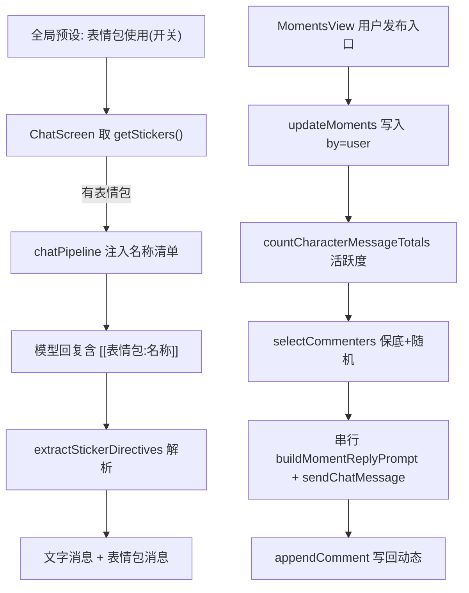

# 角色发表情包 + 用户发动态 技术设计

Feature Name: sticker-reply-and-user-moments
Updated: 2026-09-29

## 描述

两项独立纯 JS 功能，复用现有表情包、动态、全局预设、评论提示词等模块。

- 表情包：在全局预设注入「表情包使用」说明 + 名称清单，解析助手回复中的 `[[表情包:名称]]`，拆成文字消息 + 表情包消息。
- 用户动态：新增发布入口，按「最活跃保底 + 随机」选评论角色，后台串行生成评论。

## 架构



## 组件与接口

### 依赖

无新增依赖。复用 `expo-*` 与现有模块。

### `src/presets.js`（修改）

新增内置预设：

```text
{
  id: 'stickers',
  name: '表情包使用',
  description: '允许角色在合适的时候用表情包回应。',
  prompt: '你可以在合适的时候用表情包表达情绪……当你想发表情包时，在回复中单独写一行：[[表情包:名称]]，名称必须是下列之一：{{stickers}}。不要自造名称，也不要每句都发。'
}
```

### `src/stickerDirectives.js`（新增，纯函数）

```text
STICKER_DIRECTIVE_PATTERN                  // /\[\[表情包[:：]\s*([^\]\n]+?)\s*\]\]/g
extractStickerDirectives(text, names) -> { text, stickers: string[] }
resolveStickerNames(stickers) -> string[]  // 去重、trim、过滤空
buildStickerPrompt(names) -> string        // 生成注入片段；names 为空返回 ''
```

- `extractStickerDirectives`：按名称白名单过滤；剥离标记；返回剩余正文与命中名称数组。
- 白名单大小写/全角冒号容错。

### `src/chatPipeline.js`（修改）

- `buildRequestMessages` 新增 `stickerNames` 参数。
- 全局预设段内把 `{{stickers}}` 替换为名称清单（逗号分隔）；无预设或清单为空时不注入。

### `src/ChatScreen.js`（修改）

- `requestReply` / `requestReplyGroup` 在取 `getEnabledGlobalPresetPrompts()` 时并行取 `getStickers()`，得到 `stickerNames` 传入 `buildRequestMessages`。
- 回复落盘前解析：`extractStickerDirectives(reply, names)`。
  - 文字消息：`role: 'assistant'`，`text` 为剥离后的正文（可能为空）。
  - 表情包消息：`role: 'assistant'`，`kind: STICKER_MESSAGE_KIND`，`image: { uri, mime, stickerId, stickerName }`。
- 通过 `stickerName → sticker` 映射补全 uri/mime（来自 `getStickers()`）。
- 正文为空且只有表情包时，不显示空文字消息。

### `src/moments/commenters.js`（新增，纯函数）

```text
countCharacterMessageTotals(sessions, loadedMessages) -> { [characterId]: number }
rankCharactersByActivity(characters, totals) -> characterId[]   // 降序，含并列
selectCommenters({ characters, totals, max = 7, random = Math.random }) -> characterId[]
pickRandom(list, count, random) -> item[]
```

- `selectCommenters` 规则：保底=活跃度最高全部（可 > max）；保底 < max 时从剩余随机补至 max；保底 ≥ max 时只用保底。
- 排除活跃度为 0 的角色（从未对话的不评论）？——**保留**：无对话的角色活跃度为 0，仍可被随机抽中补位，但不作为保底。

### `src/moments/runUserMomentComments.js`（新增，执行器）

```text
runUserMomentComments({ momentId, signal }) -> Promise<void>
```

- 读 moments / characters / sessions / API 配置。
- 计算活跃度 → `selectCommenters` → 串行对每个角色 `buildMomentReplyPrompt` + `sendChatMessage` + `normalizeMomentReply` → `updateMoments` 合并评论。
- `inFlight` Set 防并发重复；单角色失败静默；沿用 `moments/momentReply.js` 的提示词与解析。

### `src/MomentsView.js`（修改）

- 顶部新增发布输入框 + 发送按钮。
- 发布：构造 `by: 'user'` 动态（作者标识本人），`updateMoments` 写入后调用 `runUserMomentComments`。
- 进行中状态复用现有 `replying` 机制显示「xx正在评论…」。

### `src/storage/moments.js`（修改，如需）

- `normalizeMoment` 增加作者类型字段 `authorType: 'user' | 'character'`（缺省按 `characterId` 是否为空推断），保证老数据兼容。

## 数据模型

```text
Moment (新增字段) -> { ..., authorType: 'user' | 'character' }
Comment (复用)    -> { id, by, characterId?, name, text, createdAt, likedByCharacter }

表情包指令 -> [[表情包:名称]]
```

## 正确性属性

1. 表情包名称白名单外一律丢弃，模型无法自造。
2. 无表情包时不注入说明，不产生空清单指令。
3. 用户动态评论角色总数规则：保底可超 7，保底 <7 才随机补足。
4. 随机源可注入，便于确定性测试。
5. 单角色评论失败不影响其余角色，也不影响动态本体。
6. 老动态（无 `authorType`）读取后仍正常。

## 错误处理

- 表情包解析：无匹配返回原文与空数组，不抛错。
- 评论生成失败：静默跳过该角色。
- 动态读取损坏：沿用 `updateMoments` 抛错拒绝覆盖写。
- 无可用角色：不生成评论，不报错。

## 测试策略

- 脚本：`extractStickerDirectives`（白名单命中/未命中、多标记、剥离正文、全角冒号）。
- 脚本：`selectCommenters`（保底独占、并列并列全保、<7 随机补足、≥7 只用保底、排除本人、活跃度 0 可补位）。
- 脚本：`pickRandom` 注入固定 random 的确定性。
- 脚本：`countCharacterMessageTotals` 按角色累加、排除群聊。
- 打包验证：`expo export --platform android`。
- 手动验证（`SMOKE_TEST.md`）：角色发表情包（含自造名称被丢弃）、用户发动态并收到多角色评论。

## 参考

[^1]: (src/moments/runHousemateReactions.js) - 串行评论执行器先例
[^2]: (src/moments/momentReply.js) - 评论提示词与解析先例
[^3]: (src/chatMedia.js) - 表情包消息与上下文投影先例
[^4]: (src/storage/stickers.js) - 表情包数据结构
[^5]: (src/presets.js) - 全局预设结构
