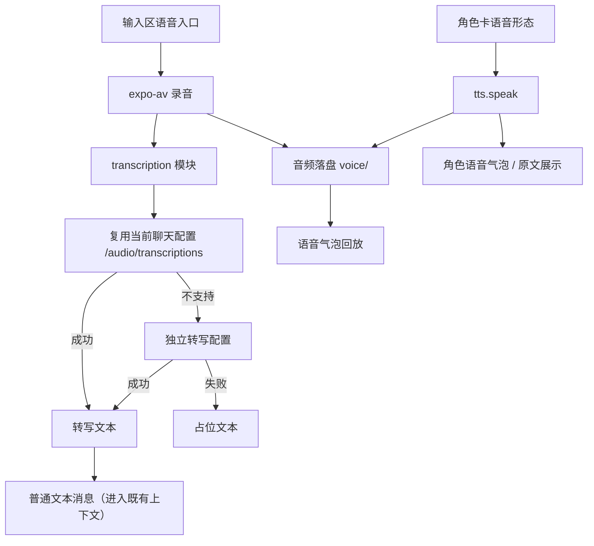

# 语音消息 技术设计

Feature Name: voice-message
Updated: 2026-09-29

## 描述

在既有聊天与 TTS 之上新增语音消息。用户录音经转写后作为普通文本消息进入既有发送链路；角色语音复用 `src/tts/`；音频以文件形式保存在 `documentDirectory/voice/`，消息只存引用。转写采用「先复用当前聊天 API 配置、失败引导补配、再失败存占位」的降级顺序。全链路纯前端，无自建后端、无 WebRTC。

## 架构



## 组件与接口

### 依赖

- 复用已有 `expo-av`（录音 + 播放）、`expo-speech`（系统 TTS）。
- 转写走 RN 内置 `FormData` + `fetch`，不新增依赖。
- 麦克风权限经 `app.json` 的 `android.permissions` / `expo-av` 插件启用。

### `src/transcription.js`（新增）

```text
normalizeTranscriptionConfig(raw) -> { mode, name, baseUrl, apiKey, model }
resolveTranscription({ chatConfig, dedicated }) -> { baseUrl, apiKey, model, source }
transcribeAudio({ config, fileUri, signal }) -> Promise<{ text, unsupported?: boolean }>
isUnsupportedTranscriptionError(error) -> boolean
```

- `resolveTranscription` 的优先级：独立转写配置 > 复用聊天配置（需求 3.1、3.3）。
- `transcribeAudio`：构造 `FormData`，字段 `file`（`{ uri, name, type }`）与 `model`（默认 `whisper-1`），POST `{baseUrl}/audio/transcriptions`，解析 `{ text }`。
- 端点不存在（404）或返回明确的「不支持」错误时，返回 `unsupported: true`（需求 3.2）。
- 复用聊天配置时，地址按 `normalizeChatUrl` 的规则回退到根：转写端点固定在 `{origin}/v1/audio/transcriptions`，不复用 `/chat/completions` 后缀。

### `src/storage/settings.js`（修改）

- 新增 `getTranscriptionSettings()` / `saveTranscriptionSettings(settings)`，键 `@easychat2_transcription`：

```text
{
  activeId: string,            // '' 表示不使用独立配置，仅复用聊天来源
  configs: [{ id, name, baseUrl, apiKey, model }]
}
```

- `apiKey` 走 `setJsonWithSecrets` / `readJsonWithSecrets`（密钥保险箱），与 `imageGen` / `vector` 同构。

### `src/storage/sessions.js`（修改）

- 新增 `@easychat2_voice_file::<sessionId>` 之外，语音文件复用消息内 `audio.uri` 引用，不额外建索引键；回收逻辑并入 `collectVoiceFiles()`。
- `collectVoiceFiles()`：扫描所有会话消息的 `audio.uri` 与待发送引用，删除 `voice/` 下未被引用的文件；读取损坏时保守返回，不删除（沿用 `collectChatImageFiles` 模式）。
- `deleteSessionInternal` / `deleteSessionsInternal` 的清理链路调用 `collectVoiceFiles()`。

### `src/voiceMessages.js`（新增，纯函数）

```text
VOICE_MESSAGE_KIND = 'voice'
createVoiceMessage({ id, role, text, audio, timestamp }) -> Message
getVoicePromptText(message) -> string          // 上下文投影：text 或占位
isVoiceMessage(message) -> boolean
```

- 上下文投影：`text` 非空则用 `text`；为空用 `[用户发来一段语音]`（需求 3.4）。
- 历史语音不重新回传音频（非目标）。

### `src/chatPipeline.js`（修改）

- `buildHistory` 与媒体激活文本对 `kind: 'voice'` 消息使用 `getVoicePromptText`，与图片/表情包的 `getMessagePromptText` 对齐。

### `src/chat/useChatRecorder.js`（新增 hook）

- 封装录制生命周期：`startRecording()` / `stopRecording()` / `cancelRecording()` / 权限申请 / 时长上下限 / 状态。
- 录音结束产出 `{ uri, durationMs, mime }`，交给 `transcription` 与落盘。

### `src/chat/VoiceBubble.js`（新增展示组件）

- 语音气泡：时长、播放/暂停、加载与错误态；播放复用 `expo-av`。
- 由 `MessageBubble` 在 `isVoiceMessage` 时渲染。

### `src/CharacterEditForm.js` / `src/storage/characters.js`（修改）

- 角色卡新增字段 `voiceDisplay`：`'text' | 'voice-text' | 'voice'`，默认 `'text'`。

### `src/chat/useChatTts.js`（修改）

- 角色回复后按 `voiceDisplay` 决定是否自动合成；语音合成结果落盘并生成角色语音气泡。
- `'voice'` 模式下隐藏正文（正文仍入库）。

### `src/ChatScreen.js`（修改）

- 输入区接入语音入口与录制反馈。
- 发送流程：录音 → 转写 → 复用/独立/占位 → 作为普通文本消息发送。
- 角色回复后按角色卡语音形态生成语音气泡。
- 会话内缓存「当前来源是否支持转写」的判定（需求 3.5）。

### `src/SettingsScreen.js`（修改）

- 「对话配图」附近新增「语音转文字」配置卡：`CollapsibleSelect` 选当前配置 + 新增/删除 + 就地编辑（名称/地址/密钥/模型）+ 默认「仅复用当前聊天来源」。
- 「确认模型能力」弹窗新增「支持语音识别」开关（需求 6.1）。

### `src/storage/apiConfigs.js` / `src/api.js`（修改）

- API 配置新增 `supportsAudio`，纳入 `getConfigFingerprint`（需求 6.3）。

### `app.json`（修改）

- 从 `blockedPermissions` 移除 `android.permission.RECORD_AUDIO`；`expo-av` 插件声明麦克风权限文案（需求 7.1）。

## 数据模型

```text
@easychat2_transcription -> { activeId, configs: [{ id, name, baseUrl, apiKey, model }] }

Message(kind='voice') -> {
  id, role, kind: 'voice', text,          // 转写或原文，可能为空
  audio: { uri, mime, durationMs },
  timestamp
}

角色卡 -> { ..., voiceDisplay: 'text' | 'voice-text' | 'voice' }

documentDirectory/voice/<id>.<ext>        // 实际音频文件
```

## 正确性属性

1. 转写失败不写入消息记录；占位文本不包含任何密钥。
2. `pending` 占位消息不落盘（沿用既有约束）。
3. 语音文件回收读取到损坏会话时保守返回，不删除。
4. `'voice'` 模式隐藏正文但不影响入库、上下文与记忆。
5. 复用转写判定按会话缓存，不对必然失败的端点重复请求。
6. 录音与播放不并发占用麦克风导致互相打断（录音独立于 TTS 播放）。

## 错误处理

- 未授权麦克风：`需要麦克风权限才能发送语音`。
- 转写端点不支持（404）：`当前模型来源不支持语音转写，可在设置中单独配置语音转文字`。
- 转写网络失败：静默降级为占位文本，不弹窗打断发送。
- 音频缺失/损坏：气泡内提示 `语音不可用`，不阻断聊天。
- 合成失败：降级为仅文字并保留正文。

## 测试策略

- 脚本：`normalizeTranscriptionConfig` 默认值与规范化；`resolveTranscription` 优先级（独立 > 复用）；`transcribeAudio` 的 FormData 字段与地址拼接（注入假 `fetch`）；`isUnsupportedTranscriptionError` 对 404 / 明文错误体的判定。
- 脚本：`voiceMessages` 的上下文投影（有文本用文本、空文本用占位）与消息构造。
- 脚本：设置读写默认与密钥保险箱引用（沿用 `characterStorage.test.mjs` 的 `src/storage/*` 按需转 CJS 加载器）。
- 脚本：`collectVoiceFiles` 的引用保护与损坏保守返回。
- 打包验证：`npx expo export --platform android`。
- 手动验证（`SMOKE_TEST.md`）：录音→转写→发送；复用不支持时引导补配；三档语音形态；语音气泡回放；删除会话后文件回收。

## 阶段归属

- 本设计对应路线图的**阶段 1（纯 JS 陪伴）**：不依赖原生工程、不依赖本地模型。
- 端侧转写（`expo-speech-recognition`）作为后续阶段离线兜底，不在本次范围。

## 参考

[^1]: (src/tts/index.js) - 云端合成与 `expo-av` 播放先例
[^2]: (src/storage/vector.js) - 多配置 + 密钥保险箱先例
[^3]: (src/storage/sessions.js) - `collectChatImageFiles` 文件回收先例
[^4]: (src/chatMedia.js) - 媒体消息与上下文投影先例
