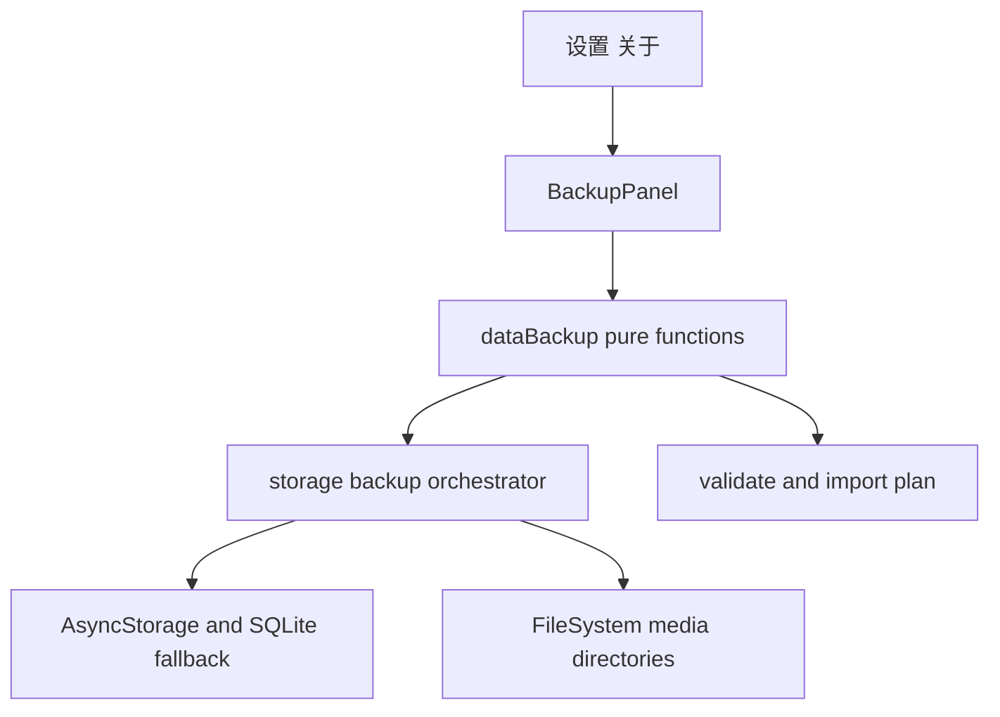

# 数据导入导出设计

Feature Name: data-backup
Updated: 2026-10-01

## Description

本功能使用单个 JSON 备份包承载 AsyncStorage 数据快照和应用媒体文件。导出通过 `expo-document-picker`/`expo-sharing` 完成；恢复先校验，再按领域写回既有键和媒体目录。

## Architecture



`dataBackup.js` 负责版本、脱敏、pending 过滤、合并计划和媒体路径校验。`storage/backup.js` 负责读取键、调用安全存储边界、读写文件和执行恢复。写入遵循既有索引最后提交约定；API 密钥默认永不进入备份包。

## Components and Interfaces

- `src/dataBackup.js`: `BACKUP_SCHEMA_VERSION`, `buildBackupPayload`, `validateBackupPayload`, `planBackupImport`, `sanitizeApiConfigs`。
- `src/storage/backup.js`: `exportBackup`, `importBackup`，负责 AsyncStorage/FileSystem 编排和结果统计。
- `src/BackupPanel.js`: 导入、导出、合并/覆盖确认和结果展示。
- `src/SettingsScreen.js`: About 卡片入口。

## Data Models

```text
BackupPayload = {
  schemaVersion: 1,
  appVersion: string,
  exportedAt: number,
  secretsExcluded: true,
  storage: [{ key: string, value: JSON-compatible value }],
  apiConfigs: { configs: [{ ...config, apiKey: '' }], activeId: string },
  media: [{ path: string, base64: string }]
}
```

媒体 `path` 只允许 `avatars/`、`stickers/`、`chat-images/`、`voice/` 目录下的相对路径。消息导出前过滤 `pending: true`，API 配置中的 `apiKey`、`appSecretKey`、`secure:v1:*` 引用全部清空或排除。

## Correctness Properties

1. `validateBackupPayload(buildBackupPayload(data))` succeeds。
2. `planBackupImport` 不会产生 `pending: true` 消息。
3. API 密钥和安全存储引用不会出现在序列化结果中。
4. 同一稳定 id 的导入记录覆盖现有记录，其他记录保持不变。
5. 非允许媒体目录的路径会被拒绝。

## Error Handling

- JSON 解析失败、版本不支持、结构非法：导入前失败，不写本机数据。
- 单个媒体文件损坏：整体导入失败并保留现有数据。
- 存储写入失败：记录诊断并返回已完成/失败统计。
- 密钥缺失：恢复后 API 配置保留无密钥状态，提示用户重新填写。

## Test Strategy

- 纯函数测试：版本校验、密钥脱敏、pending 过滤、媒体路径校验、合并/覆盖计划、序列化往返。
- 存储测试：大值读取、分键恢复、媒体文件恢复、失败注入。
- 真机走查：设置入口、导出分享、合并恢复、覆盖恢复、重启后角色/消息/媒体可读。
