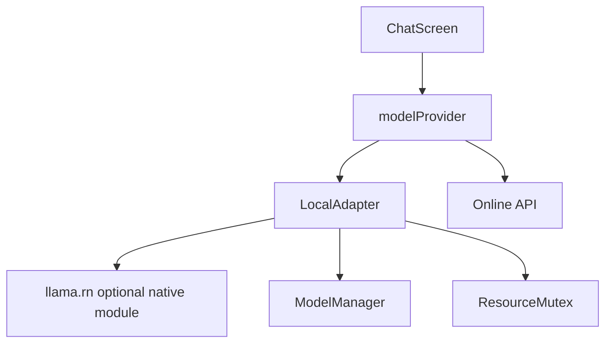

# 本地模型能力设计

Feature Name: local-model
Updated: 2026-10-01

## Description

本地模型能力分为模型管理、模式切换、资源互斥和推理适配四层。`llama.rn` v0.10+要求 React Native New Architecture；当前项目为 Expo SDK 54、RN 0.81、`newArchEnabled:true`，方向匹配。原生适配器保持可选，模块缺失、模型未就绪或推理失败时回退在线 API。

Android 模型必须先写入应用文档目录并传递本地路径，不能直接把 `content://` URI 传给 `llama.rn`。

## Architecture



## Components and Interfaces

- `src/localModel/modelManager.js`: 模型元数据、下载、校验、删除和状态。
- `src/localModel/adapter.js`: 可选 `llama.rn` 适配器，统一 `isAvailable`、`send`、`release`。
- `src/modelProvider.js`: 在线/本地路由与一次性在线回退。
- `src/resourceMutex.js`: 录音、TTS、本地推理的重负载互斥锁。
- `src/LocalModelPanel.js`: 设置页模型管理和状态。

## Data Model

```text
LocalModelSettings = {
  enabled: boolean,
  modelId: string,
  modelName: string,
  modelUrl: string,
  modelPath: string,
  modelSha256: string,
  modelBytes: number,
  contextSize: number,
  gpuLayers: number,
  updatedAt: number
}
```

## Correctness Properties

1. 未完成下载、校验失败或被删除的模型不能进入 ready 状态。
2. 本地模型关闭或不可用时，在线 API 请求参数与现有链路一致。
3. 同一时刻只有一个重负载资源持有者。
4. 删除当前模型后，设置指针自动回退为 disabled。
5. 推理失败不会丢失用户消息，在线 API 回退只发生一次。
6. 模型版本或哈希变化时，旧文件不能被当作新模型使用。

## Error Handling

- 下载失败保留旧模型和现有在线 API 能力。
- 哈希失败删除临时文件并显示重新下载入口。
- 原生模块缺失显示“当前构建未包含本地模型能力”，不影响在线聊天。
- 推理失败保留用户消息并切换在线 API 一次。

## Test Strategy

- 纯函数测试：模型状态、版本、资源互斥、在线/本地选择和回退。
- 存储测试：下载元数据、删除、哈希不匹配和失败回滚。
- Android 验证：prebuild/release、新架构注册、模型本地路径和资源释放。
- 真机验证：下载大模型、加载、生成、取消、释放、在线回退和内存压力。
