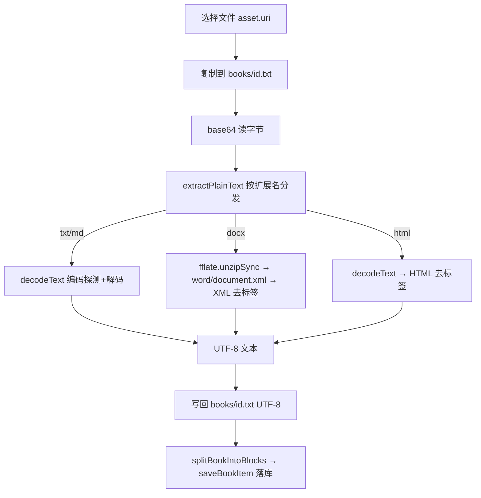

# 本地书籍纯文本导入（多格式 + 多编码）

Feature Name: book-plain-text-imports
Updated: 2026-10-03

## Description

在现有 UTF-8 纯文本导入基础上，支持从 `.docx`/`.html` 提取纯文本，并对 `.txt/.md` 做字符编码自动识别（UTF-8 / UTF-16 / GB18030 / BIG5），消除导入乱码。正文仍恒落 `documentDirectory/books/<id>.txt`（UTF-8），复用现有分块/分页/进度。

## Architecture



探测与解码的关键取舍：**自研轻量探测 + `text-encoding`（WHATWG TextDecoder polyfill）解码**。理由：`iconv-lite` 依赖 Node `stream`/`buffer`、`jschardet` 体积 7.3M，均不适合 RN/Hermes；`text-encoding` 无 Node 内置依赖、支持 `gb18030`/`big5`/`utf-16`。

## Components and Interfaces

### `src/books/decodeText.js`（纯函数，可 Node 直测）

```js
export const ENCODING_FFFD_THRESHOLD = 0.005;
export function decodeBytes(bytes) -> { text, encoding, replacementRatio }
// 抛 { code:'ENCODING' } 当全部候选超过阈值
```

- `detectBom(bytes)`：`EF BB BF`→utf-8；`FF FE`→utf-16le；`FE FF`→utf-16be。
- `isStrictUtf8(bytes)`：手写严格 UTF-8 校验（拒绝过长编码/代理区/越界）。
- 无 BOM 且非严格 UTF-8：候选 `['gb18030','big5']`，各自 `TextDecoder` 解码后统计 U+FFFD 占比，取占比最低者；并列时优先 `gb18030`。
- `looksLikeUtf16(bytes)`：按奇/偶位零字节占比判定无 BOM 的 UTF-16。
- 换行统一为 `\n`（`\r\n`/`\r` → `\n`）。

### `src/books/extractText.js`（纯函数，可 Node 直测）

```js
export const BOOK_EXTENSIONS = ['.txt', '.md', '.markdown', '.docx', '.html', '.htm'];
export function isSupportedBookFile(fileName) -> boolean
export function extractPlainText({ fileName, bytes }) -> { text, format }
```

- `txt/md/markdown` → `decodeBytes`。
- `docx` → `fflate.unzipSync` 取 `word/document.xml`；`w:tab`→`\t`、`w:br`→`\n`、`</w:p>`/空 `<w:p/>`→`\n`；剥离其余标签；解 XML 实体。缺 `word/document.xml` → `{code:'UNSUPPORTED_FORMAT'}`。
- `html/htm` → `decodeBytes` 后去 `<script>/<style>`，块级标签转 `\n`，剥离标签，解 HTML 实体。

### `src/books/importBook.js`（改造）

- 扩展名白名单改用 `BOOK_EXTENSIONS`。
- 读文件改为 **base64**（`FileSystem.EncodingType.Base64`）→ `Buffer.from(base64,'base64')`（项目已有全局 Buffer polyfill）。
- 用 `extractPlainText` 得到 UTF-8 文本，**写回** `books/<id>.txt`，再 `saveBookItem`（新增 `encoding` 字段）。
- 任一步失败：删除半成品文件、不写索引（沿用现状）。

## Data Models

- 书籍条目新增可选字段 `encoding`（探测到的编码标识，如 `utf-8`/`gb18030`/`big5`/`utf-16le`）。
- `decodeBytes` 返回 `{ text, encoding, replacementRatio }`。

## Correctness Properties

1. **往返一致**：对任意文本 T，以 utf-8 / GB18030 / BIG5 / UTF-16(BOM) 编码为字节后，`decodeBytes` 还原出的文本等于 T（换行统一后）。
2. **格式提取**：`.docx` 提取保留段落边界、去除标签、正确解实体；`.html` 去除脚本样式。
3. **失败无残留**：提取/解码失败时不留半成品文件、不写索引、不产生幽灵条目。
4. **确定性**：同字节输入得到同编码判定。

## Error Handling

- `UNSUPPORTED_FORMAT`：扩展名不支持 / `.docx` 缺 `word/document.xml`。
- `ENCODING`：全部候选解码替换符占比超阈值 → 提示「无法识别编码」，给出「另存为 UTF-8」指引。
- 文件系统/复制错误：清理 `dest` 后原样抛出。

## Test Strategy

- `tests/bookDecodeText.test.mjs`：BOM 三态、严格 UTF-8、GBK/GB18030/BIG5 字节 → 正确中文、UTF-16 无 BOM、全候选失败 → `ENCODING`、换行统一。
- `tests/bookExtractText.test.mjs`：测试内用 `fflate.zipSync` 现造 `.docx` → 提取文本；`.html` 去标签/脚本；扩展名分发与不支持报错。
- `tests/booksReader.test.mjs`：更新导入链路源码断言（base64 读字节、`extractPlainText` 接入、失败清理）。
- 覆盖率：`decodeText.js`/`extractText.js` 纳入统计；`importBook.js` 保持 RN 排除。

## References

- 读取字节与落盘：`src/books/importBook.js`、`src/books/library.js`
- 分块/分页：`src/books/blocks.js`
- 解压：`src/workspace/docx.js`（`fflate` 用法参考）
- 决策：`.monkeycode/specs/2026-10-03-book-plain-text-imports/requirements.md`
