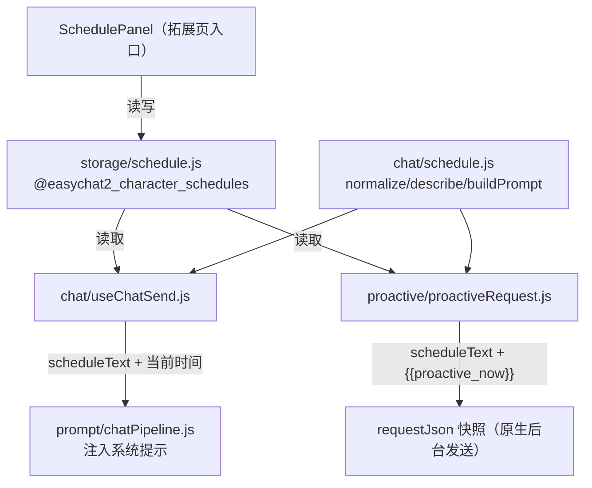

# 角色作息 / 日程表 技术设计

Feature Name: character-schedule
Updated: 2026-10-07

## Description

按角色保存一份可选作息（起床 / 上班 / 下班 / 睡觉 + 启用开关），在系统提示中注入一段**静态作息规则**（含四个时刻 + 「按当前时间判断状态」的说明），普通对话与主动消息共用同一段文本。因为主动消息的请求快照在保存时生成、在数天后的任意时刻触发，作息规则必须是**与时间无关的静态文本**，由模型结合系统提示里的「当前时间」自行判断时段（沿用既有 `{{proactive_now}}` 占位符机制）。不新增原生模块。

## Architecture

## Components and Interfaces

### 纯逻辑 `src/chat/schedule.js`（可 Node 直测）

- `DEFAULT_SCHEDULE`：`{ enabled:false, wake:'07:00', workStart:'09:00', workEnd:'18:00', sleep:'23:00' }`。
- `parseTime(text)` → 分钟数 | null；`formatTime(minutes)` → `HH:MM`。
- `normalizeSchedule(raw)`：逐字段校验，非法回退默认；`enabled` 取布尔。
- `isScheduleActive(schedule)`：`enabled` 且四个时刻都合法。
- `describeSchedule(schedule)` → `起床 07:00 · 工作 09:00–18:00 · 睡觉 23:00`（供 UI 预览与提示词）。
- `resolveSchedulePeriod(schedule, date)` → `'sleep' | 'work' | 'free'`（供测试/预览；跨零点处理）。
- `buildSchedulePrompt(schedule)` → 静态规则文本：含 `describeSchedule` + 「按当前时间判断睡眠/工作/空闲并调整口吻与长度」的说明。

### 存储 `src/storage/schedule.js`

键 `@easychat2_character_schedules` = `{ [characterId]: schedule }`（小而稳定，单键即可）。沿用 `readJsonStatus` / `backupCorruptValue`。
- `getCharacterSchedule(characterId)` → schedule | null。
- `getAllCharacterSchedules()` → map。
- `saveCharacterSchedule(characterId, schedule)` → 归一化后写入；关闭且全默认时可保留（不主动删）。
- `deleteCharacterSchedule(characterId)`。
- 模块内 `onCharacterDeleted('schedule', ...)` 注册角色删除清理。

### 注入 `src/prompt/chatPipeline.js`

`buildRequestMessages` 新增 `scheduleText` 参数：与 `locationText` 同法，置于系统提示靠前位置（时间行之后）。

### 接线 `src/chat/useChatSend.js`

`requestReply` 中读取当前会话所属角色的作息：`scheduleText = buildSchedulePrompt(schedule)`；`currentTimeText = buildTimeAwareText(chatOptions.timeAware || isScheduleActive(schedule))`（启用作息即附带当前时间，使规则可生效）；把 `scheduleText` 传入 `buildRequestMessages`。未启用则 `scheduleText=''`、时间行口径不变。

### 接线 `src/proactive/proactiveRequest.js`

- `buildProactiveRequestMessages` 新增 `scheduleText` 参数，追加进 `extraSystemPrompt`（与「本轮任务」同段，静态文本，可安全快照）。
- `buildProactiveRequestJson` 动态 import `../storage/schedule.js`，按 `character.id` 读取作息，算出 `scheduleText`，并把 `timeAware` 有效值设为 `timeAware || isScheduleActive(schedule)`（决定是否写入 `{{proactive_now}}` 占位符）。

### UI `src/SchedulePanel.js` + 拓展页接线

- `SchedulePanel`：`PaneHeader` + 角色选择（复用折叠选择器模式）+ 启用 `Switch` + 四个时间输入（`TextInput`，`HH:MM`）+ 预览（`describeSchedule`）+ 保存按钮（走 `saveCharacterSchedule`）。
- `src/extension/ExtensionHome.js`：companion 组新增 `{ id:'schedule', route:'ext-schedule', icon:'time-outline', labelKey:'ext.home.schedule', descKey:'ext.home.schedule.desc' }`。
- `src/extension/ExtensionStack.js`：注册 `ext-schedule`。

## Data Models

作息：`{ enabled: boolean, wake: 'HH:MM', workStart: 'HH:MM', workEnd: 'HH:MM', sleep: 'HH:MM' }`。

存储：`@easychat2_character_schedules` = `{ [characterId: string]: 作息 }`。

## Correctness Properties

1. **静态可快照**：`buildSchedulePrompt` 输出不含具体时间戳，主动消息快照在触发时依然有效（时段判断交给模型 + `{{proactive_now}}`）。
2. **无作息零影响**：未启用 / 未配置时，对话与主动消息的提示词、时间行口径与当前版本一致。
3. **跨零点睡眠**：`sleep > wake` 时睡眠时段跨越零点，判断正确。
4. **归一兜底**：非法时间输入回退默认，不产生非法存储。
5. **角色级隔离与清理**：按 `characterId` 存取；角色删除后清理。

## Error Handling

- 存储损坏：`backupCorruptValue` 后按空处理（同其它域）。
- 时间输入非法：保存时归一为默认值，UI 回填归一后的值。
- 读取作息失败：注入侧静默降级为空（不阻断发送）。

## Test Strategy

- `tests/schedule.test.mjs`（纯逻辑）：parse/format、normalize 兜底、isScheduleActive、resolveSchedulePeriod（含跨零点）、describeSchedule、buildSchedulePrompt 含规则关键词且不含时间戳。
- `tests/scheduleStorage.test.mjs`（行为，AsyncStorage mock）：get/save/getAll/delete、损坏备份、角色删除清理。
- `tests/scheduleUi.test.mjs`（源码锚点）：拓展入口/路由、面板字段与保存、注入接线、i18n 词条齐备。
- 全门禁：`npm run lint` / `npm test` / `guard:structure` / `test:coverage` / `expo export`。

## References

[^1]: （`src/chat/currentTime.js`）- 时间感知行格式。
[^2]: （`src/proactive/proactiveRequest.js`）- 主动消息快照与 `{{proactive_now}}` 占位符。
[^3]: （`src/storage/moments.js`）- 主动消息设置存储范式。
[^4]: （`src/extension/ExtensionHome.js`）/（`src/extension/ExtensionStack.js`）- 拓展页入口与路由。
