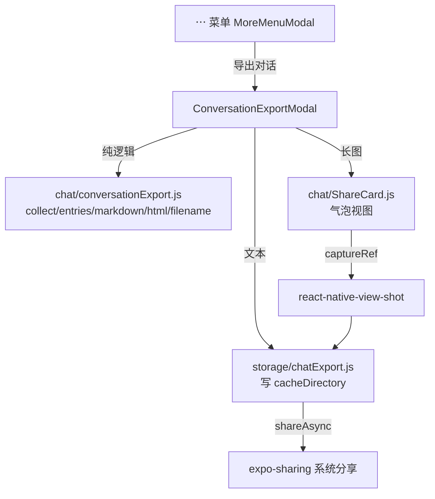

# 对话导出为长图 / 分享卡片 技术设计

Feature Name: chat-conversation-export
Updated: 2026-10-07

## Description

在聊天页「⋯」菜单增加「导出对话」，把当前会话导出为三种人类可读格式：带气泡样式的长图（离屏渲染 + `react-native-view-shot` 截图，经系统分享面板分享）、Markdown、HTML。全部本地完成、无后端。纯逻辑（消息提取 + Markdown/HTML 生成）与 UI（导出面板 + 分享卡片）分离，前者 Node 直测。

## Architecture

- **纯逻辑** `src/chat/conversationExport.js`：不依赖 RN，Node 直测。
- **文件写出** `src/storage/chatExport.js`：域内封装 `expo-file-system`（lint 分层要求），写 `cacheDirectory/chat-export/`。
- **长图**：`ShareCard` 渲染气泡，`captureRef(scrollRef, { snapshotContentContainer: true })` 捕获整段内容为 PNG。
- **分享**：`expo-sharing` 的系统分享面板；不可用时 Alert 提示。

## Components and Interfaces

### `src/chat/conversationExport.js`（纯逻辑）

- `isExportableMessage(message)`：user/assistant 且非 pending/transient。
- `collectExportMessages(messages, { max })` → `{ messages, truncated, omitted }`，超上限取最近 N 条。
- `messageBodyText(message)`：正文取纯文本；无正文时按媒体给占位（`[图片]` / `[表情包：名]` / `[视频]` / `[语音]`）。
- `messageSpeaker(message, { userName, characterName })`：用户→用户名；角色→speakerName/角色名。
- `buildExportEntries(messages, meta)` → `[{ role, speaker, time, body }]`，正文经 `maskSecrets` 脱敏。
- `toMarkdown(entries, meta)` / `toHtml(entries, meta)`：HTML 版本对内容转义。
- `exportFileName(meta, ext)`：`<标题>-<日期>.<ext>`，净化非法字符。

### `src/storage/chatExport.js`（文件写出）

- `chatExportDirectory(documentDirectory?)` → `cacheDirectory/chat-export/`。
- `writeChatExportText({ fileName, content })` → 返回 `{ uri }`。
- `persistChatExportImage({ tmpUri, fileName })` → 移动截图临时文件到导出目录，失败清理半成品。
- `sweepChatExportFiles({ keepNewest })`：滚动清理历史导出，防止缓存膨胀。

### `src/chat/ShareCard.js`（RN UI，气泡视图）

props：`{ entries, meta, theme, fonts, tokens, styles }`。渲染标题头（标题 + 导出时间 + 截断提示）、逐条气泡（用户右对齐 / 角色左对齐、说话人名、时间、正文）。

### `src/chat/ConversationExportModal.js`（RN UI，导出面板）

props：`{ visible, onClose, messages, title, characterName, userName, isGroup }`。
- 顶部格式分段：长图 / Markdown / HTML。
- 长图页：`ScrollView` 预览 `ShareCard` + 「分享长图」按钮（截图后分享）。
- Markdown/HTML 页：说明 + 「分享」按钮。
- 导出中禁用按钮；失败 Alert。

### 接线 `src/ChatScreen.js` + `MoreMenuModal`

在「⋯」菜单「其他」段前新增「导出对话」项，打开 `ConversationExportModal`，传入当前会话 `messages`（`renderedMessages`）与标题/角色名/用户名。

## Data Models

导出条目（entries 元素）：`{ role: 'user'|'assistant', speaker: string, time: string, body: string }`。

导出元信息（meta）：`{ title, exportedAt, truncated, omitted, count }`。

## Correctness Properties

1. **只导当前会话**：输入为当前会话消息数组，不跨会话。
2. **无占位污染**：pending/transient 消息被过滤（需求 5.1）。
3. **可读占位**：媒体消息转 `[图片]/[表情包：名]/[视频]/[语音]`（需求 5.3）。
4. **脱敏**：正文经 `maskSecrets`（需求 5.4）。
5. **HTML 安全**：正文/说话人/标题全部转义，消息内容不能破坏文档结构（需求 4.2）。
6. **截断有上限**：长图与文本导出都受 `EXPORT_MAX_MESSAGES` 约束，超限提示已截断（需求 2.4）。
7. **不落半成品**：截图/写盘失败时清理临时文件（需求 2.5）。

## Error Handling

- 无可导出消息：面板按钮禁用并提示。
- 分享不可用（如 Web）：Alert 提示无法分享。
- 截图失败 / 写盘失败：Alert 提示，清理临时文件。
- 长图渲染需要图片加载：捕获前短暂 settle，避免截到空白。

## Test Strategy

- `tests/conversationExport.test.mjs`（行为，纯逻辑）：过滤/截断、占位、说话人、Markdown/HTML 生成、HTML 转义、文件名净化、脱敏。
- `tests/chatExport.test.mjs`（行为，AsyncStorage/FileSystem mock）：写文本、移动截图、失败清理、滚动清理。
- `tests/chatExportUi.test.mjs`（源码锚点）：菜单入口、面板格式切换、ShareCard 气泡、captureRef 用法、中英词条齐备。
- 全门禁：`npm run lint` / `npm test` / `guard:structure` / `test:coverage` / `expo export`。

## References

[^1]: （`src/chat/MoreMenuModal.js`）- 聊天页「⋯」菜单。
[^2]: （`src/screenWatch/capture.js`）- 既有 `react-native-view-shot` 用法。
[^3]: （`src/storage/secrets.js`）- `maskSecrets` / `SECRET_PATTERN`。
[^4]: （`src/chat/plainText.js`）- `messageCopyText` 富文本转纯文本。
[^5]: （`src/BackupPanel.js`）- 既有 `expo-sharing` 分享范式。
