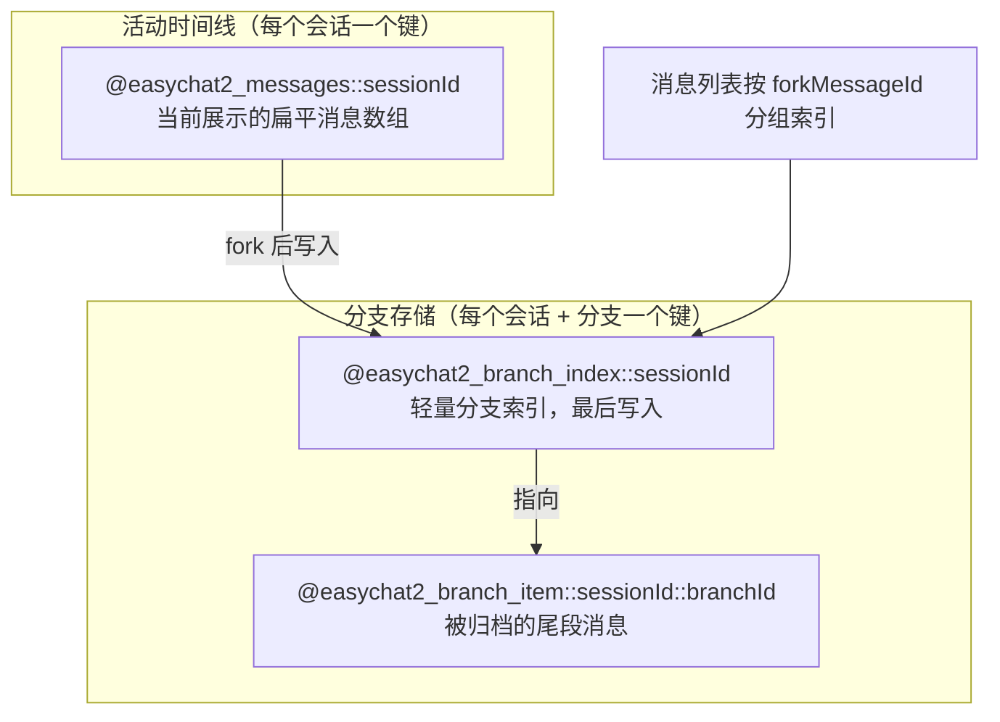
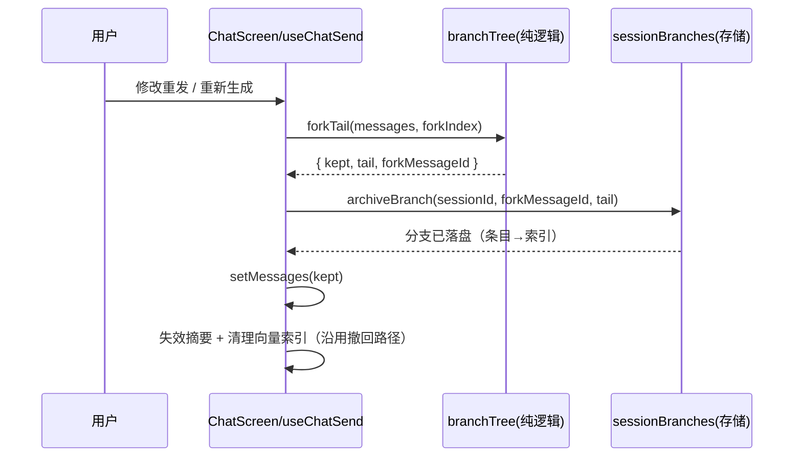
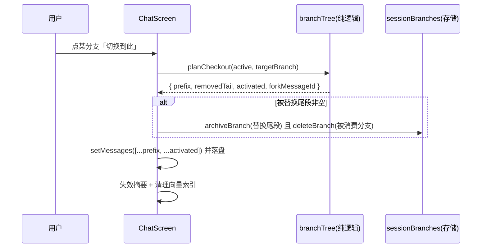

# 对话树 / 分支回溯 技术设计

Feature Name: conversation-branch-tree
Updated: 2026-10-07

## Description

把「修改重发 / 重新生成 / 删除连续尾段」从「直接丢弃被撤回的尾段」升级为「先把尾段归档成一条分支，再让活动时间线前进」。活动时间线仍是会话消息键里的扁平数组（不改既有读写形状），被归档的尾段按分支独立分键存放。消息列表在分叉点渲染一条可展开的「此处另有 N 条分支」入口，展开后可就地切换到任意分支；切换本身也是无损的：被替换掉的当前尾段会归档为新分支，因此任何被展示过的消息都不会因来回切换而消失。

首期仅覆盖单聊（群聊沿用现状）。

## Architecture



- **活动时间线**：沿用 `@easychat2_messages::<sessionId>` 的单键扁平数组，零形状改动。
- **分支索引**：`@easychat2_branch_index::<sessionId>`，存轻量描述符数组（不含消息正文），作为写盘提交点，最后写入。
- **分支条目**：`@easychat2_branch_item::<sessionId>::<branchId>`，存该分支被归档的消息尾段。
- **分叉点**：分支描述符里的 `forkMessageId`，指向活动时间线上「最后一个公共消息」的 id；`''` 表示从会话最前分叉。

### 关键流程





## Components and Interfaces

### 纯逻辑 `src/chat/branchTree.js`（可 Node 直测）

- `branchFromTail(messages, forkIndex)`：把 `messages.slice(forkIndex)` 作为被归档尾段，返回 `{ kept, tail, forkMessageId }`；`tail` 为空时返回 `null`。
- `planCheckout(activeMessages, branch)`：`branch = { id, forkMessageId, messages }`，返回 `{ prefix, removedTail, activated, forkMessageId }`；`forkMessageId === ''` 时 `prefix = []`；在活动数组里找不到 `forkMessageId` 时返回 `{ stale: true }`。
- `groupBranchesByFork(branches)`：按 `forkMessageId` 分组为 `Map`，供列表渲染与计数。
- `buildBranchDescriptor(branchId, forkMessageId, messages, now)`：生成索引描述符 `{ id, forkMessageId, createdAt, messageCount, preview }`，`preview` 复用 `sessionLibrary.buildPreview`。
- `createBranchId(now, random)`：会话内唯一 id（`branch-<now>-<rand>`），`random` 可注入以便测试。
- `dedupeBranchMessages(branch, existing)`：判断被归档尾段是否与某既有分支内容一致（JSON 相等），用于避免来回切换产生重复分支。

### 存储 `src/storage/sessionBranches.js`（新领域模块）

沿用 `sessionCore` 的 mutation 队列与键助手，读写形状与其它存储域一致（返回 `{ status }`）。

- `sessionBranchIndexKey(sessionId)` / `sessionBranchItemKey(sessionId, branchId)` / `sessionBranchItemPrefix(sessionId)`（放在 `sessionCore.js`）。
- `getBranchIndexStatus(sessionId)` → `{ status: 'ok' | 'missing' | 'corrupt', branches: [] }`。
- `archiveBranch(sessionId, forkMessageId, messages)` → 先写条目、后写索引（索引是提交点），返回新分支描述符。
- `getBranch(sessionId, branchId)` → `{ status, branch }`；索引里有、条目读不出时返回 `corrupt`。
- `deleteBranch(sessionId, branchId)` → 先改索引、后删条目。
- `deleteAllBranches(sessionId)` → 删除索引与该会话全部条目键（供会话删除调用）。
- `pruneStaleBranches(sessionId, activeMessageIds)` → 清理 `forkMessageId` 已不在活动时间线上的分支（会话被大幅删除后）。

### 存储改动 `src/storage/sessionFiles.js`

`collectMediaFilesInternal` 除 `@easychat2_messages::*` 外，还须扫描 `@easychat2_branch_item::*`，把分支引用的图片/语音纳入「在用集合」，避免孤儿回收误删仅被分支引用的媒体文件（需求 4.4）。

### 存储改动 `src/storage/sessionList/mutations.js`

`deleteSessionInternal` / `deleteSessionsInternal` 除消息/摘要/草稿外，追加 `deleteAllBranches(sessionId)`（需求 4.5）。

### 编排 `src/chat/useChatSend.js`

- 新增内部 `archiveActiveTail(sessionId, kept, removedTail, forkMessageId)`：调用 `archiveBranch`，失败不阻断撤回主链路（仅告警），成功则触发分支索引刷新计数。
- `editUserMessage`：在 `setMessages(latestPlan.messages)` 之前调用 `archiveActiveTail`（`forkMessageId = latestPlan.messages` 的最后一条 id）。
- `regenerateMessage`：在 `requestReply` 之前调用 `archiveActiveTail`（removedTail = `messages.slice(index)`）。
- 新增 `checkoutBranch(branch)`：按 `planCheckout` 计算，若 `stale` 则弹「分叉点已不存在」并刷新索引；否则先归档被替换尾段、再落盘活动时间线，并沿用 `invalidateHistorySummaries` + `removeVectorIndexForSession`；发送中禁止切换。
- 返回 `branchesRefreshToken`（自增），供 UI 重新读取索引。

### Hook `src/chat/useChatBranches.js`（新，RN-free 可测逻辑下沉）

接收 `{ activeSessionId, refreshToken }`，加载 `getBranchIndexStatus`，返回 `{ branches, loading, reload }`。切会话时重载，`refreshToken` 变化时重载。

### UI `src/chat/BranchForkRow.js` + `MessageList.js`

- `BranchForkRow`：内联可展开条。收起时显示 `↩ 此处另有 N 条分支`；点开展开该分叉点的分支卡片列表（预览 + 相对时间），每条卡片带「切换到此」「删除」。组件通过 props 注入 `t`、主题样式与回调，不直接读存储。
- `MessageList.js`：按 `branchesByFork` 在对应消息之后插入 `BranchForkRow`；`forkMessageId === ''` 的分支渲染在列表顶部（首条之前）。
- `ChatScreen.js`：组装 `branchesByFork`、`onCheckoutBranch`、`onDeleteBranch` 并传入 `MessageList`。

## Data Models

消息（活动时间线元素）：新增可选字段 `branchId?: string`，缺省等价 `''`（根）。旧消息无此字段照常展示（需求 4.2）。

分支描述符（索引元素）：

```
{
  id: string,            // 会话内唯一分支 id
  forkMessageId: string, // 分叉点消息 id；'' = 会话最前
  createdAt: number,
  messageCount: number,
  preview: string        // 尾段最后一条可展示文本，复用 buildPreview
}
```

分支条目（`@easychat2_branch_item::<sessionId>::<branchId>` 的值）：被归档消息的数组，元素形状与活动消息一致（含 `image` / `audio` / `speakerId` / `timestamp` / `branchId`）。

## Correctness Properties

1. **无损性**：任何曾出现在活动时间线上的消息，要么仍在活动数组，要么存在于某条分支条目，要么属于用户显式删除（且该删除若为连续尾段也已归档）。切换与撤回都不静默丢弃。
2. **提交点**：归档时先写分支条目、后写索引；删除时先改索引、后删条目。索引是唯一事实源。
3. **空不建支**：被归档尾段为空时不产生分支（需求 1.4）。
4. **幂等切换**：来回切换同一内容不产生无限重复分支（`dedupeBranchMessages` 兜底；消费即删除源分支）。
5. **媒体不误删**：分支引用的媒体始终纳入回收扫描的在用集合（需求 4.4）。
6. **归档即出上下文**：被归档消息移出活动数组后，不再进入 `buildRequestMessages` / 摘要 / 向量召回（需求 4.6）；切换恢复后由既有摘要失效 + 向量重建覆盖。
7. **会话级隔离**：分支键严格以 `sessionId` 命名空间，删除会话连带清理。

## Error Handling

- 索引/条目读取失败（`corrupt`）：与消息读取一致，先 `backupCorruptValue` 留副本，UI 提示「分支读取失败」但不影响聊天主链路。
- 归档写盘失败：`editUserMessage` / `regenerateMessage` 仍继续撤回（不阻断），仅开发告警 + 分支计数不变；下次撤回重新尝试归档新尾段。
- 切换遇 `forkMessageId` 不在活动时间线：判定分支陈旧，弹提示并 `pruneStaleBranches`，不改变活动时间线。
- 发送中/流式切换：直接拒绝（guard），不影响发送。
- 删除当前活动路径所依附的分支：分支条目删除不影响活动数组本身（需求 5.2）；只从入口计数中移除。

## Test Strategy

- `tests/branchTree.test.mjs`（行为，纯函数）：fork 边界、`forkMessageId=''`、checkout 计算、stale 检测、分组计数、preview、去重。
- `tests/sessionBranches.test.mjs`（行为，AsyncStorage mock，仿 `characterStorage.test.mjs` 的 CJS 加载器）：archive→get→list→delete 生命周期；索引最后写入；删除会话清理全部条目键；损坏读取返回 `corrupt` 且留副本。
- `tests/sessionFiles` 相关（行为/源码锚点）：回收扫描包含 `@easychat2_branch_item::*`；断言仅被分支引用的媒体不被回收。
- `tests/messageSelection.test.mjs` 扩展：连续尾段删除判定（用于需求 1.3 的归档分支）。
- UI 结构锚点：`BranchForkRow` 折叠/展开、`MessageList` 在分叉消息后插入入口、`branchesByFork` 空时不渲染（需求 2.3）。
- 回归：`npm test` 全量、`npm run lint`、`npm run guard:structure`、`npm run test:coverage`、`npx expo export --platform android`。

## Implementation Plan（分阶段，每阶段独立可验证）

- **P1 纯逻辑 + 存储**：`branchTree.js`、`sessionCore` 键助手、`sessionBranches.js`、`sessionFiles` 回收扩展、会话删除清理；配套测试。不动 UI。
- **P2 撤回接线**：`useChatSend` 归档尾段（edit/regenerate/连续尾段删除），保证「撤回即留支」；补测试。
- **P3 读取 + UI**：`useChatBranches`、`BranchForkRow`、`MessageList`/`ChatScreen` 组装；分叉入口可视化。
- **P4 切换 + 管理**：`checkoutBranch`、删除分支、stale 清理、摘要/向量联动。
- **P5 文档与验收**：同步 `AGENTS.md` / `.monkeycode/docs/`，真机走查 `SMOKE_TEST.md`。

## References

[^1]: （`src/storage/sessionMessages/messages.js`）- 会话消息单键读写与损坏兜底。
[^2]: （`src/chat/useChatSend.js`）- `editUserMessage` / `regenerateMessage` 撤回路径。
[^3]: （`src/chat/messageSelection.js`）- `getEditResendPlan` 修改重发计划。
[^4]: （`src/storage/sessionFiles.js`）- 聊天媒体孤儿回收扫描。
[^5]: （`src/storage/sessionCore.js`）- 会话键助手与 mutation 队列。
[^6]: （`src/chat/MessageList.js`）- 消息列表渲染段。
