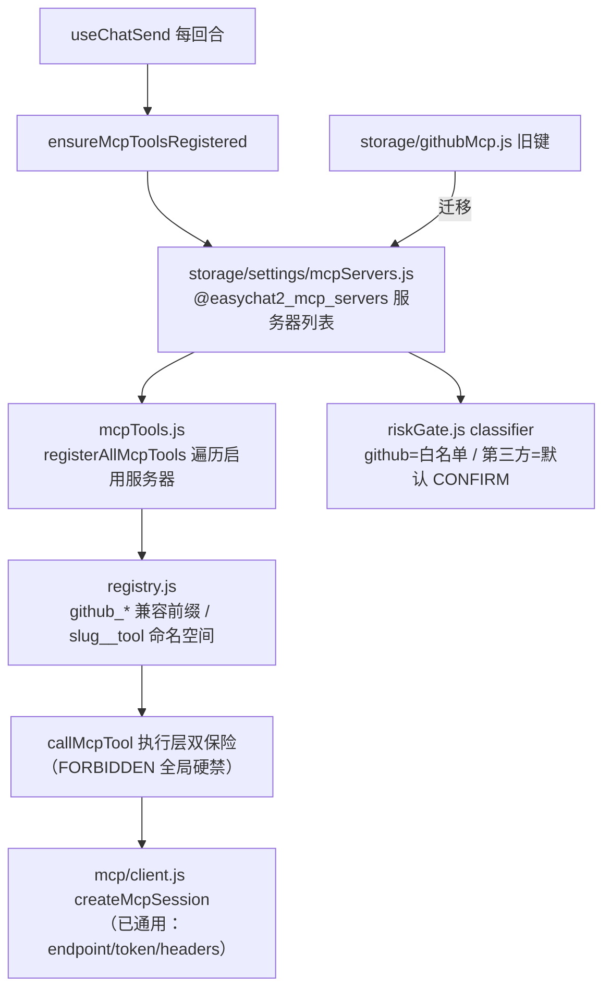

# 工作区 agent 扩展性改造（对齐 Claude Code / Codex）技术设计

Feature Name: agent-extensibility
Updated: 2026-10-09
来源：审核助手任务书《EasyChat2 工作区 agent 扩展性改造》（2026-10-09）；
基线核实：任务书写 main @ 666c900，实际 main @ e9cf39a（差两批 localModel UI，与本域零交集）。

## 描述

把「单 agent、单 MCP 服务器（GitHub 写死）、零技能系统、权限只有逐条确认、shell 无状态」
扩成可扩展架构。三阶段：① 扩展性地基（通用 MCP / 工作区记忆文件 / 权限规则引擎）、
② 技能与命令层（SKILL.md / 斜杠命令 / 声明式钩子）、③ 体验对齐（持久 shell 会话 /
子代理 / 工作区模板）。本 spec 覆盖阶段 1，T1（通用 MCP）首批落地。

## 架构（T1 通用 MCP 多服务器）

## 组件与接口

### `src/storage/settings/mcpServers.js`（新）

- 键 `@easychat2_mcp_servers`，形状：
  `[{ id, name, endpoint, authMethod: 'token'|'oauth', mcpToken, headers: {}, enabled,
     connectedAt, toolCatalog: [{name, description, parameters, tier}], deniedNames, tierOverrides }]`
- 密钥字段名用 **`mcpToken`**（不是 `token`）：SECRET_FIELDS 按字段名全局匹配，
  通用名 `token` 会波及其它域同名字段；`mcpToken` 按名登记进 secretStore。
- `normalizeMcpServer` / `normalizeMcpServers` / `getMcpServers` / `saveMcpServers` /
  `upsertMcpServer` / `removeMcpServer` / `makeMcpServerId`（slug 生成）。
- **GitHub 迁移**：`serverFromGithubSettings(githubSettings)` 把旧 `@easychat2_github_mcp`
  映射为内置记录（id 固定 `github`）；`migrateGithubServer()` 幂等（列表已有 github 记录
  即跳过，凭据为空也跳过）。

### `src/mcp/client.js`（小改）

- `createMcpSession` 已通用（endpoint/token/fetchImpl），补 `headers` 支持（自定义请求头，
  第三方服务器常要 `X-Api-Key` 之类）。
- 错误文案 "GitHub MCP ..." → 通用 "MCP ..."（错误 code 不变；i18n 用新键
  `error.mcp.serverError`，`error.mcp.githubError` 保留不动）。

### `src/mcp/riskGate.js`（分级分域）

- `classifyMcpTool(name, { serverId = 'github', tierOverrides } = {})`：
  1. `FORBIDDEN_NAME_PATTERN`（delete/remove/force/admin）**全局** → DENIED
     （跨服务器无解锁途径，安全不回退）；
  2. `serverId === 'github'` → 现有白名单（READONLY/CONFIRM，非名单 DENIED 不变）；
  3. 第三方服务器 → `tierOverrides[name]`（readonly/confirm/denied）或**默认 CONFIRM**
     （用户自己配置的服务器，工具集未知：默认不放行只读、每次调用确认）。
- `filterMcpToolsForRegistration(tools, options)` 透传分级选项。
- 向后兼容：不传第二参 = GitHub 语义（既有测试全绿）。

### `src/workspace/mcpTools.js`（多服务器注册）

- 前缀：`serverToolPrefix(server)` —— 内置 github 保持 `github_`（**兼容已配用户与既有
  github_* 工具名**）；其他服务器 `${server.id}__`（命名空间隔离）。
- `registerMcpServerTools(server, hooks)` / `unregisterMcpServerTools(server)`；
  `registerAllMcpTools(servers, hooks)`（遍历 enabled）/ `unregisterAllMcpTools()`。
- 会话复用：按服务器 id 各持一份（Map），`closeAll` 释放。
- `callMcpTool(server, mcpName, args, hooks)`：执行层双保险（FORBIDDEN + 服务器分级重查）。
- `ensureMcpToolsRegistered({ getServers, ...hooks })` 取代
  `ensureGithubMcpToolsRegistered`（后者保留为兼容包装）；调用点 `useChatSend.js` 更名。

### 设置 UI（T1-b，下一批）

工作区设置加「MCP 服务器」管理页：列表/添加/启停/连接测试/工具分级浏览/删除。
本批不做，登记 tasklist；数据层与注册层已可直接被 UI 消费。

## 关键决策

1. **第三方默认 CONFIRM 而非 DENIED**：现状 classifyMcpTool 对非白名单一律 DENIED，
   对「用户自己配置的服务器」等于不可用；改成默认 CONFIRM（每次调用逐条确认）+
   FORBIDDEN 全局硬禁 —— 比「静默放行只读」安全，比「一律拒绝」可用。
2. **GitHub 兼容优先**：内置记录 id='github'、前缀 `github_`、白名单语义全部保持，
   已配 token 用户零感知（迁移幂等、失败不破坏旧键）。
3. **不做任意 JS 插件 / 不做 PTY**：同任务书（T6 声明式 JSON、T7 先走方案 B），
   决定登记审查待办。
