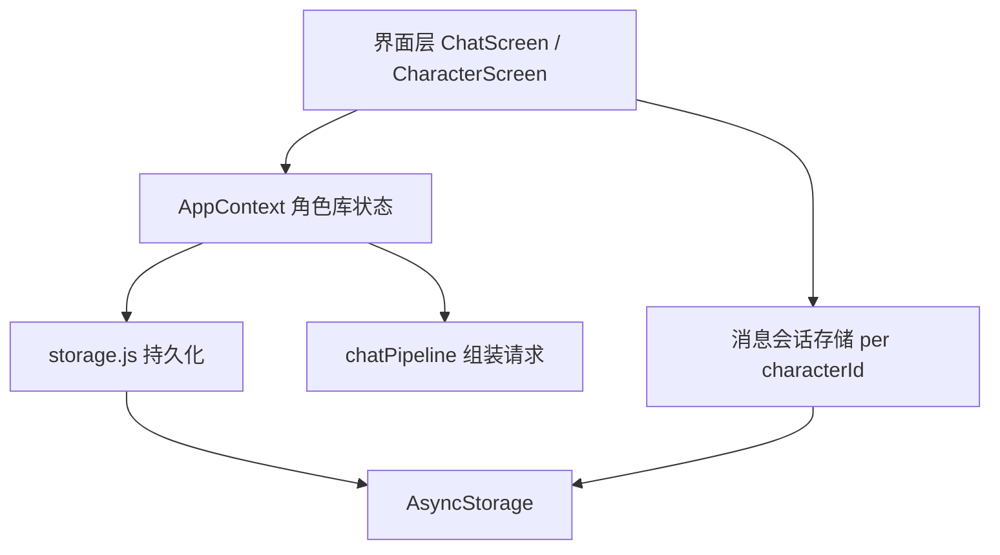
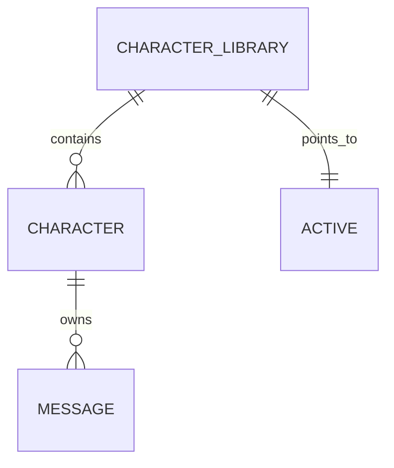

# 角色库与切换

Feature Name: character-library
Updated: 2026-09-14

## Description

本功能把当前「单角色」模型升级为「角色库」。角色以集合形式持久化，应用持有一个当前角色 `id`，并在聊天页与角色页提供切换入口。消息会话已经按角色 `id` 隔离存储，本次改造在此基础上补齐角色的增删改查、切换入口、最近使用排序与旧数据迁移。

目标：

- 角色列表可陈列、可切换、可新增（新建/导入）、可编辑、可删除。
- 每个角色对应独立消息会话，切换即切换会话。
- 当前角色选择与最近使用时间持久化。
- 旧版单角色数据与旧消息键平滑迁移。

## Architecture





角色库以 `@easychat2_characters` 存储 JSON 数组，当前角色 `id` 以 `@easychat2_active_character` 存储。消息仍以 `@easychat2_messages::<characterId>` 存储。旧键 `@easychat2_character` 仅用于一次性迁移。

## Components and Interfaces

### `src/storage.js`

新增与调整的导出：

| 导出 | 说明 |
|------|------|
| `getCharacterLibrary()` | 读取角色库；首次调用触发旧数据迁移，并保证包含默认角色 |
| `saveCharacterLibrary(list)` | 序列化角色库 |
| `getActiveCharacterId()` | 读取当前角色 `id` |
| `setActiveCharacterId(id)` | 持久化当前角色 `id` |
| `getActiveCharacter()` | 组合读取：当前角色不存在时回退默认角色 |
| `upsertCharacter(character)` | 按 `id` 新增或替换一个角色 |
| `deleteCharacter(characterId)` | 从角色库移除角色，并删除其消息会话键 |
| `DEFAULT_CHARACTER` | 增加 `lastUsedAt` 字段 |

旧版兼容：`getCharacterLibrary` 在 `@easychat2_characters` 缺失时读取 `@easychat2_character`，迁移为单元素数组并设为当前角色；旧键数据不再写入但仍保留。

### `src/context/AppContext.js`

| 成员 | 说明 |
|------|------|
| `character` | 当前角色（由 `activeId` 在库中解析，缺失时回退 `DEFAULT_CHARACTER`） |
| `characters` | 角色库数组，按最近使用时间降序 |
| `loaded` | 库与当前角色读取完成标记 |
| `updateCharacter(patch)` | 更新当前角色并持久化，失败回滚并抛出 |
| `switchCharacter(id)` | 切换当前角色，更新其 `lastUsedAt` 并持久化 |
| `addCharacter(character)` | 新增角色并设为当前角色 |
| `deleteCharacter(id)` | 删除非默认角色及其消息，必要时切换当前角色 |

保留 `characterRef` / `loadedRef` 以避免闭包陈旧，并维持「加载完成前拒绝写入」与「失败回滚后抛出」的既有约定。

### `src/CharacterScreen.js`

- 顶部展示角色库列表，条目显示名称、选中标记与最近使用时间。
- 点选条目调用 `switchCharacter`。
- 「新建角色」创建空白角色（仅带默认提示词，不复制当前角色内容），「导入角色卡」复用 `cardParser` 后经 `addCharacter` 入列。
- 编辑区仍编辑当前角色，保存调用 `updateCharacter`。
- 非默认角色提供删除入口，删除前二次确认。

### `src/ChatScreen.js`

- 顶部展示当前角色名称，点击弹出角色切换列表（复用 `Modal` 组件，点选即调用 `switchCharacter`）。
- 切换后 `activeCharacterIdRef` 与消息加载副作用按既有逻辑响应 `characterId` 变化，自动中断进行中的请求并加载目标角色消息；进行中的流式生成在切换时被中断，迟到回复被丢弃（与现有「切换角色竞态防护」一致）。

## Data Models

```javascript
// 角色（新增 lastUsedAt）
{
  id: 'default',
  name: 'EasyChat2 助手',
  systemPrompt: '...',
  systemPromptComposed: '',
  description: '',
  personality: '',
  scenario: '',
  firstMes: '',
  mesExample: '',
  creatorNotes: '',
  postHistoryInstructions: '',
  tags: [],
  worldInfo: [],
  regexScripts: [],
  lastUsedAt: 0
}
```

| 键 | 内容 |
|----|------|
| `@easychat2_characters` | `Character[]` |
| `@easychat2_active_character` | `string`（角色 `id`） |
| `@easychat2_character` | 旧版单角色，仅迁移读取 |
| `@easychat2_messages::<id>` | 对应角色消息 |
| `@easychat2_messages` | 旧版消息，仅默认角色兜底读取 |

## Correctness Properties

1. **默认角色常存**：角色库在读取后必然包含 `id = default` 的角色，且该角色不可删除。
2. **当前角色可解析**：当前角色 `id` 不在库中时，解析结果回退默认角色，并将 `@easychat2_active_character` 修正为 `default`。
3. **消息与角色一一对应**：消息仅在 `@easychat2_messages::<characterId>` 下读写；删除角色时同一 `id` 的消息键一并移除。
4. **不持久化占位**：任何写入路径均过滤 `pending: true`。
5. **排序确定**：列表按 `lastUsedAt` 降序排列，`lastUsedAt` 相同时按 `id` 升序保证稳定。
6. **迁移幂等**：迁移在库键缺失时触发一次；`@easychat2_characters` 已存在时不再读取旧键。
7. **唯一 id**：新增角色经现有 `ensureUniqueIds` 与时间戳规则保证库内 `id` 唯一。
8. **切换即中断**：进行中的流式生成在角色切换时被中断，迟到回复与错误按 `activeCharacterIdRef` 守卫被丢弃。

## Error Handling

| 场景 | 处理 |
|------|------|
| 角色库解析失败 | 回退为仅含默认角色的库 |
| 角色字段缺失 | 与 `DEFAULT_CHARACTER` 合并补全 |
| 角色库中无默认角色 | 读取后补入默认角色 |
| 写入失败 | Context 回滚内存状态并抛出，界面 `Alert` 提示 |
| 删除当前角色 | 先切换到列表中的其他角色再移除，界面捕获异常 |
| `loaded` 未完成时写入 | `updateCharacter` 抛出，界面提示稍后再试 |

## Test Strategy

- 使用 Node + Babel 的临时脚本，以内存版 AsyncStorage 桩覆盖纯逻辑：
  - 迁移：仅有旧键时生成库并设为当前角色；库键存在时不读旧键。
  - `getActiveCharacter` 对无效 `id` 回退默认。
  - `upsertCharacter` / `deleteCharacter` 的增删与消息键删除调用。
  - 排序：`lastUsedAt` 降序、并列时 `id` 升序。
  - 反序列化失败回退默认库。
- 界面行为（列表点选、聊天页顶部切换、删除确认）通过 `npm run start` 手动验证。
- 回归：现有 25 项卡解析/管线用例保持通过。

## References

[^1]: (File) - [storage.js](/workspace/src/storage.js)
[^2]: (File) - [AppContext.js](/workspace/src/context/AppContext.js)
[^3]: (File) - [CharacterScreen.js](/workspace/src/CharacterScreen.js)
[^4]: (File) - [ChatScreen.js](/workspace/src/ChatScreen.js)
[^5]: (Doc) - [角色.md](/workspace/.monkeycode/docs/专有概念/角色.md)
[^6]: (Doc) - [消息会话.md](/workspace/.monkeycode/docs/专有概念/消息会话.md)
[^7]: (Doc) - [数据与状态.md](/workspace/.monkeycode/docs/模块/数据与状态.md)